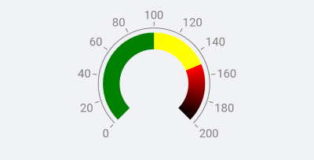
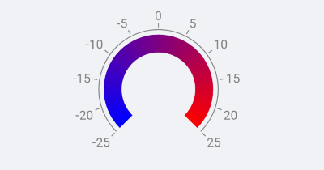
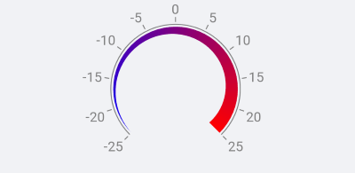

# Ranges

The gauge ranges are elements that are usually used to give context to the indicated value (or values). The ranges denote certain parts of the axis range and are usually displayed with different colors to provide additional information. All ranges are arranged in an area alongside the axis line (parallel to it). The distance from this area to the axis line is defined by the **Offset** property of the **GaugeRangesDefinition** class. The gauge does not use any strategy to stack ranges or to avoid overlapping of ranges, so you will need to set adequate **From**/**To** values to ensure that they are not positioned on top of each other. 

To include ranges in your gauge you need to set the **Ranges** property. You need to pass an object of type **GaugeRangesDefinition** which has a **Ranges** collection. In this collection you can add **GaugeRange** items when you need a solid color, or you can add **GaugeGradientRange** items when you need gradient colors.

<snippet id='gauge-ranges'/>

## Gradient Ranges

As demonstrated above, you can use the **GaugeGradientRange** to include ranges with gradient color. To do this you can add gradient stops to the **GradientStops** collection of the gradient range. Each gradient stop has a color and an offset value that determine the final appearance of the item. The offset can either be treated as a relative value (between 0 and 1) or an absolute value (between the axis' minimum and axis' maximum). This is defined by the **IsOffsetRelative** property of the gradient range. 

Here is an example when offset is relative

<snippet id='gauge-ranges-relative-offset'/>

and when the offset is absolute

<snippet id='gauge-ranges-absolute-offset'/>

>important A sample Ranges example can be found in the Gauge/Featuers folder of the [SDK Samples Browser application]().

## See Also

- [Indicators]()
- [Positioning]()
