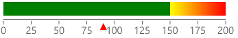

# Horizontal Gauge

The **RadHorizontalGauge** control allows you to display the scale's range in a linear form, horizontally oriented.

## Setting up the gauge

The following example shows a **RadHorizontalGauge**'s basic set up.

<snippet id='gauge-types-horizontalgauge-xaml'/>
<snippet id='gauge-types-horizontalgauge-code'/>

Here is the result:

 

>important A sample Horizontal Gauge example can be found in the Gauge/GaugeTypes folder of the [SDK Samples Browser application]().

## See Also

- [Radial Gauge]()
- [Vertical Gauge]()
- [Axis]()
- [Indicators]()
- [Ranges]()