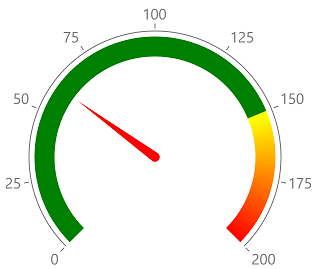

# Radial Gauge

The **RadRadialGauge** control allows you to display the scale's range in a radial form.

## Setting up the gauge

The following example shows a **RadRadialGauge**'s basic set up.

<snippet id='gauge-types-radialgauge-xaml'/>
<snippet id='gauge-types-radialgauge-code'/>

This is the result:

>important A sample Radial Gauge example can be found in the Gauge/GaugeTypes folder of the [SDK Samples Browser application]().

## Setting rotation and radius

The radial gauge allows you to define the radius of its axis. This can be done via the **AxisRadiusFactor** property of **RadRadialGauge**. Read more about the property in the [Positioning](#radial-gauge-specifics) help article.

You can also control the start angle, the sweep angle and sweep direction of the axis. This can be done via the following properties:
- **StartAngle**: The start angle determines the origin position of the axis.
- **SweepAngle**: The sweep angle defines the size of the axis' arc. For example, if the start angle is 90 and the sweep angle is 30, the axis will be drawn between the 90th and 120th angle. If the sweep direction is counter-clockwise, the axis will be drawn between 60 and 90.
- **SweepDirection**: You can use this property to set the axis sweep direction - clockwise or counter-clockwise.

## See Also
- [Horizontal Gauge]()
- [Vertical Gauge]()
- [Axis]()
- [Indicators]()
- [Ranges]()