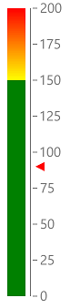

# Vertical Gauge

The **RadVerticalGauge** control allows you to display the scale's range in a linear form, vertically oriented.

 

## Setting up the gauge

The following example shows a **RadVerticalGauge**'s basic set up.

<snippet id='gauge-types-verticalgauge-xaml'/>
<snippet id='gauge-types-verticalgauge-code'/>

## See Also
- [Radial Gauge]()
- [Horizontal Gauge]()
- [Axis]()
- [Indicators]()
- [Ranges]()