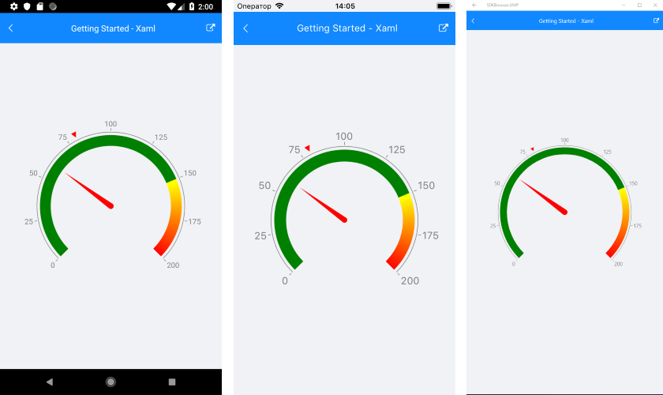

# Getting Started

In order to set up the gauge you need to set up the elements of the gauge you want to use. You need to set the axis minimum, maximum and step, so that the values of the indicators and the ranges are within the axis range and they can be positioned properly. Normally you will need at least one indicator, but you can add as many as needed. Adding gauge ranges is not necessary but is often valuable as they help give additional information about values within that range, for example too low, too high, or normal. 

>Before you proceed, please, take a look at these articles and follow the instructions to setup your app:

>- [Setup on Windows]()
>- [Setup on Mac]()

> **RadRadialGauge** is rendered via the SkiaSharp graphics library so you need to install [SkiaSharp.Views.Forms](https://www.nuget.org/packages/SkiaSharp.Views.Forms/1.55.0) to the *Android* project.

## Example

Below you can see an example of a **RadRadialGauge** with a linear axis, two indicators and three gauge ranges.

Add the following namespaces:

<snippet id='xmlns-telerikgauges'/>
<snippet id='ns-telerikgauges'/>

Proceed with defining the component:

<snippet id='gauge-getting-started-xaml'/>
<snippet id='gauge-getting-started-csharp'/>

Here is the result:
 

## See Also

- [Project Wizard]()
- [Getting Started on Windows]()
- [Getting Started on Mac]()
