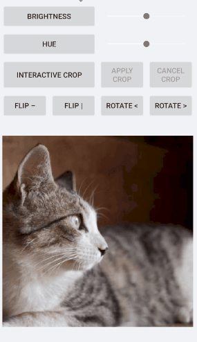

# Commands

This article explains the commands provided in ImageEditor and ImageEditorToolbar. 

## ImageEditor Commands

From R1 2022 Release RadImageEditon provides commands for programatically editing the image without the usage of the ImageEditorToolbar.  commands of type `ICommand` which all:

* `CropCommand`- crop the image
* `CropInteractiveCommand`- initiates the crop action
* `ResizeCommand`- for image resizing
* `RotateLeftCommand`- for image rotation 90 degree to the left
* `RotateRightCommand`- for image rotation 90 degree to the right
* `BlurCommand`- applies blur to the image
* `BrightnessCommand`- changes the brightness of the image
* `ContrastCommand`- changes the image contrast
* `HueCommand`- changes the image hue
* `SaturationCommand`- changes the image saturation
* `SharpenCommand`- changes the image sharpness.
* `FlipHorizontalCommand`- flips the image horizontally
* `FlipVerticalCommand`- flips the image vertically

Commands which cancel/apply the changes made in interactive commands:

* `CancelInteractiveCommand`- cancels the changes done in interactive command such as `Telerik.XamarinForms.ImageEditor.RadImageEditor.CropInteractiveCommand`
* `ApplyInteractiveCommand`- applies the changes done in interactive command such as `Telerik.XamarinForms.ImageEditor.RadImageEditor.CropInteractiveCommand`

When using the `CropInteractiveCommand` you can apply the crop changes using `ApplyInteractiveCommand` and cancel the changes using `CancelInteractiveCommand`.

### Example

ImageEditor definition in XAML:

<snippet id='imageeditor-commands-xaml'/>

**InteractiveCropCommand with Apply and Cancel commands**

<snippet id='imageeditor-interactive-commands-xam'/>

**FlipHorizontal and FlipVerical commands**

<snippet id='imageeditor-flip-commands-xaml'/>

**RotateLeft and RotateRight commands**

<snippet id='imageeditor-rotate-commands-xaml'/>

**BrightnessCommand**

<snippet id='imageeditor-brightness-command-xaml'/>

**HueCommand**

<snippet id='imageeditor-hue-command-xaml'/>



>tip Sample Commands example can be found inside the [SDKBrowser app/ImageEditor/Fetures](https://docs.telerik.com/devtools/xamarin/sdk-browser-overview#sdk-browser-application) folder.

## ImageEditor Toolbar Commands

**RadImageEditorToolbar** provides a ToolbarItem for creating a command.

* `CommandToolbarItem`: Allows executing an arbitrary user-defined command from the toolbar. The CommandToolbarItem has the following properties:

	* `Command`(`ICommand`): Specifies the command to execute.
	* `CommandParameter`(`object`): Specifies a parameter to be passed to the command upon execution.

>tip You could use the CommandToolbarItem when the ImageEditorToolbar AutoGenerateItems property is set to "False".

### Example

Here is an example how the CommandToolbarItem could be used

```XAML
<telerikImageEditor:RadImageEditorToolbar Grid.Row="1" ImageEditor="{x:Reference imageEditor}" AutoGenerateItems="False">
    <telerikImageEditor:CommandToolbarItem Text="Save" Tapped="OnSaveTapped" />
</telerikImageEditor:RadImageEditorToolbar>
```

On the Tapped event we are going to save the image on the device:

```C#
private async void OnSaveTapped(object sender, EventArgs e)
{
    var folderPath = Environment.GetFolderPath(Environment.SpecialFolder.LocalApplicationData);
    var filePath = Path.Combine(folderPath, "image.jpg");

    using (var fileStream = File.Create(filePath))
    {
        await this.imageEditor.SaveAsync(fileStream, ImageFormat.Jpeg, 0.9);
    }
    
    Application.Current.MainPage.DisplayAlert("Success!", "The Image is saved", "OK");
}
```

## See Also

- [Custom Toolbar]()
- [Effects]()
- [Image Transformations]()
- [Toolbar Styling]()