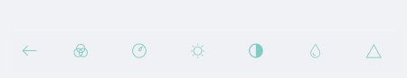

# Commands

The RadImageEditor control comes with various editing capabilities and they could be used as items included in the **RadImageEditorToolbar**.

## Example

Here is an example how to use the default RadImageEditor Toolbar and its properties:

Use the following snippet to define the RadImageEditor and RadImageEditor Toolbar:

<snippet id='imageeditor-getting-started-xaml'/>

In addition to this, you need to add the following namespace:

<snippet id='xmlns-telerikimageeditor'/>

This is the result:

## See Also

- [Custom Toolbar]()
- [Effects]()
- [Image Transformations]()
- [Toolbar Styling]()