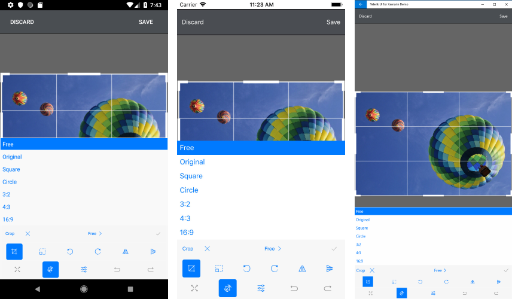
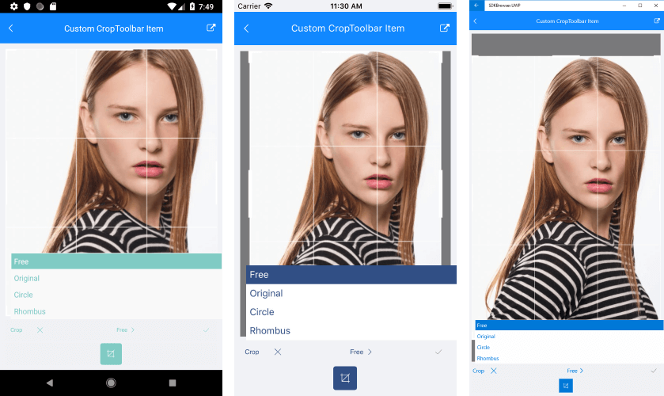

# Crop

The RadImageEditor Crop ToolbarItem is extended with properties which helps you to specify the geometry of the crop selection and the desired aspect ratio. The available options by default are:

* **Free**, **Original**, **Square**, **Circle**, **3:2**, **4:3**, **16:9**



## Custom Crop Toolbar

You could easily customize the crop definitions when setting **AutoGenerateItems="False"** to the RadImageEditorToolbar.

### Crop Definitions

* **AspectRatio**: Specifies the aspect ratio of the crop selection.
* **Geometry**: Specifies the geometry of the crop selection.
* **Text**: Specifies the text visualized inside the crop tool.


```XAML
<telerikImageEditor:RadImageEditorToolbar Grid.Row="1" ImageEditor="{x:Reference imageEditor}" AutoGenerateItems="False">
    <telerikImageEditor:CropToolbarItem>
        <telerikImageEditor:CropToolbarItem.CropDefinitions>
            <telerikImageEditor:CropDefinition AspectRatio="Free" Text="Free"/>
            <telerikImageEditor:CropDefinition Text="Circle" AspectRatio="1:1">
                <telerikImageEditor:CropDefinition.Geometry>
                    <telerikCommon:RadEllipseGeometry Center="0.5,0.5" Radius="0.5,0.5"/>
                </telerikImageEditor:CropDefinition.Geometry>
            </telerikImageEditor:CropDefinition>
        </telerikImageEditor:CropToolbarItem.CropDefinitions>
    </telerikImageEditor:CropToolbarItem>
</telerikImageEditor:RadImageEditorToolbar>
```

### Crop Tool

1. AspectRatio (AspectRatio): Represents the aspect ratio expressed as the ratio between the width and height of an image. The available options are: 

* **Free**: Special value, indicating the aspect ratio should not be constrained. Default: **0.0, 0.0**.
* **Original**: Special value, indicating the aspect ratio should match the original image. Default: **-1.0, -1.0**.
* **Square**: Special value, indicating the width and height of the image should be equal. Default: **1.0, 1.0**.

>important When set custom values for the Aspect Ratio the separator must be **:** For example: "7:2", "6:2":

```XAML
<telerikImageEditor:CropDefinition AspectRatio="7:2" Text="7:2"/>
```

>note If no aspect ration is specified explicitly, the crop tool uses the default **Free**. When a custom aspect ration is specified, the crop operation is performed with that ratio.

2. Geometry (RadGeometry): Specifies the geometry of the crop selection. The available geometries are:

* **RadRectangleGeometry**: Represents a rectangle geometry.
* **RadLineGeometry**: Represents a line geometry.
* **RadEllipseGeometry**: Represents an ellipse geometry.
* **RadPathGeometry**: Represents a complex path geometry composed of one or more path figures. In order to create a specific geomerty, you need to set a RadPathGeometry object to CropDefinition Geometry property. The RadPathGeometry object exposes a Figures property which is a collection of RadPathFigures. Each of the RadPathFigure objects is composed of one or several segments:
	* **RadArcSegment**
	* **RadArcToSegment**
	* **RadLineSegment**
	* **RadConicSegment**
	* **RadCubicSegment**
	* **RadQuadraticSegment**

More information about the RadPathGeomerty can be found in the [RadPathGeometry]() article.

>note If no geometry is specified explicitly, the crop tool uses the default **RadRectangleGeometry**. When a custom geometry is specified, the crop operation is performed with that geometry.

## Example

The snippet below shows a sample RadImageEditor and RadImageEditorToolbar definitions, where the CropToolbar is defines as follow:

<snippet id='imageeditor-custom-crop-toolbar'/>

In addition to this, you need to add the following namespaces:

```XAML
xmlns:telerikImageEditor="clr-namespace:Telerik.XamarinForms.ImageEditor;assembly=Telerik.XamarinForms.ImageEditor"
xmlns:telerikCommon="clr-namespace:Telerik.XamarinForms.Common;assembly=Telerik.XamarinForms.Common"
```



## See Also

- [Effects]()
- [History]()
