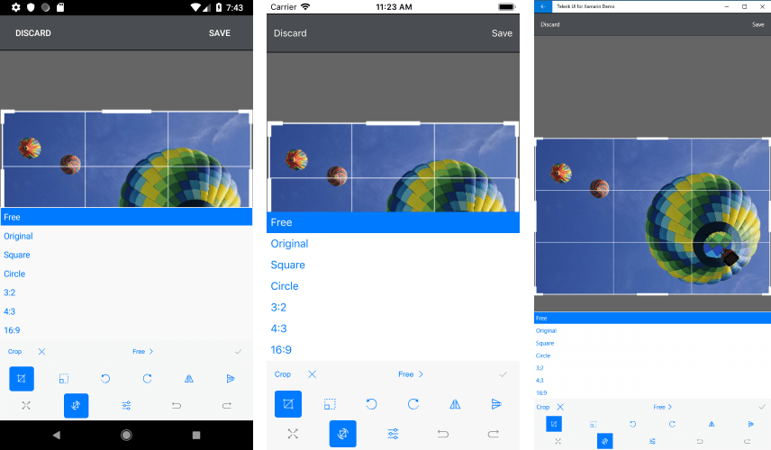

# Crop

The RadImageEditor **CropToolbarItem** has properties which help you specify the geometry of the crop selection and the desired aspect ratio. The available options by default are:

* **Free**, **Original**, **Square**, **Circle**, **3:2**, **4:3**, **16:9**



## Custom Crop Toolbar

You could easily customize the crop definitions when setting **AutoGenerateItems="False"** to the RadImageEditorToolbar.

### Crop Definitions

* **AspectRatio**: Specifies the aspect ratio of the crop selection.
* **Geometry**: Specifies the geometry of the crop selection.
* **Text**: Specifies the text visualized inside the crop tool.


```XAML
<telerikImageEditor:RadImageEditorToolbar Grid.Row="1" ImageEditor="{x:Reference imageEditor}" AutoGenerateItems="False">
    <telerikImageEditor:CropToolbarItem>
        <telerikImageEditor:CropToolbarItem.CropDefinitions>
            <telerikImageEditor:CropDefinition AspectRatio="Free" Text="Free"/>
            <telerikImageEditor:CropDefinition Text="Circle" AspectRatio="1:1">
                <telerikImageEditor:CropDefinition.Geometry>
                    <telerikCommon:RadEllipseGeometry Center="0.5,0.5" Radius="0.5,0.5"/>
                </telerikImageEditor:CropDefinition.Geometry>
            </telerikImageEditor:CropDefinition>
        </telerikImageEditor:CropToolbarItem.CropDefinitions>
    </telerikImageEditor:CropToolbarItem>
</telerikImageEditor:RadImageEditorToolbar>
```

### Crop Tool

* **AspectRatio** (*Telerik.XamarinForms.ImageEditor.AspectRatio*): Represents the aspect ratio expressed as the ratio between the width and height of an image. The specific values are: 

	* **Free**: Special value, indicating the aspect ratio should not be constrained.
	* **Original**: Special value, indicating the aspect ratio should match the original image.
	* **Square**: Special value, indicating the width and height of the image should be equal.

>important When set custom values for the **AspectRatio** the separator must be ":", for example: "7:2", "6:2".

```XAML
<telerikImageEditor:CropDefinition AspectRatio="7:2" Text="7:2"/>
```

>note If no aspect ratio is specified explicitly, the crop tool uses the default **Free**. When a custom aspect ratio is specified, the crop operation is performed with that ratio.

* **Geometry** (*RadGeometry*): Specifies the geometry of the crop selection. The available geometries are:

	* **RadRectangleGeometry**: Represents a rectangle geometry.
	* **RadLineGeometry**: Represents a line geometry.
	* **RadEllipseGeometry**: Represents an ellipse geometry.
	* **RadPathGeometry**: Represents a complex path geometry composed of one or more path figures. In order to create a specific geometry, you need to set a RadPathGeometry object to CropDefinition Geometry property. The RadPathGeometry object exposes a Figures property which is a collection of RadPathFigures. Each of the RadPathFigure objects is composed of one or several segments:
		* **RadArcSegment**
		* **RadArcToSegment**
		* **RadLineSegment**
		* **RadConicSegment**
		* **RadCubicSegment**
		* **RadQuadraticSegment**

More information about the RadPathGeomerty can be found in the [RadPathGeometry]() article.

>note If no geometry is specified explicitly, the crop tool uses the default **RadRectangleGeometry**. When a custom geometry is specified, the crop operation is performed with that geometry.

## Example

The snippet below shows a sample RadImageEditor and RadImageEditorToolbar definitions, where the CropToolbar is defined as follow:

<snippet id='imageeditor-custom-crop-toolbar'/>

In addition, you need to add the following namespaces:

```XAML
xmlns:telerikImageEditor="clr-namespace:Telerik.XamarinForms.ImageEditor;assembly=Telerik.XamarinForms.ImageEditor"
xmlns:telerikCommon="clr-namespace:Telerik.XamarinForms.Common;assembly=Telerik.XamarinForms.Common"
```


>important [SDK Browser application](https://docs.telerik.com/devtools/xamarin/sdk-browser-overview#sdk-browser-application) contains a sample Custom Crop Toolbar example. You can find it in the **ImageEditor/Features** folder.

## See Also

- [Effects]()
- [History]()
