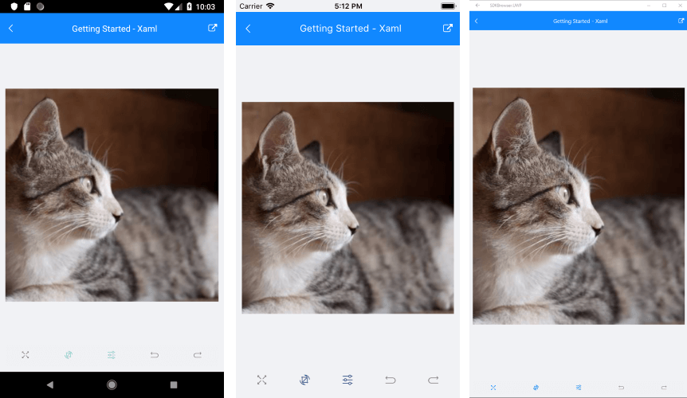

# Getting Started

This article will guide you through the steps needed to add a basic **RadImageEditor** control in your application.

* [Setting up the app](#1-setting-up-the-app)
* [Adding the required Telerik references](#2-adding-the-required-telerik-references)
* [Adding RadImageEditor control](#3-adding-radimageeditor-control)

## 1. Setting up the app

Take a look at these articles and follow the instructions to setup your app:

- [Setup app with Telerik UI for Xamarin on Windows]()
- [Setup app with Telerik UI for Xamarin on Mac]()

## 2. Adding the required Telerik references

You have two options:

* Add the Telerik UI for Xamarin Nuget package following the instructions in [Telerik NuGet package server]() topic.

If you don't want to add the all Telerik.UI.for.Xamarin nuget package, you have the option to add a separate nuget package. For RadImageEditor control you have to install the **Telerik.UI.for.Xamarin.ImageEditor** nuget package. This nuget will automatically refer the *Telerik.UI.for.Xamarin.Common*, *Telerik.UI.for.Xamarin.Primitives*, *Telerik.UI.for.Xamarin.DataControls*, *SkiaSharp* and *ShiaSharp.Views.Forms* nuget packages.

* Add the references to Telerik assemblies manually, check the list below with the required assemblies for **RadImageEditor** component:

| Platform | Assemblies |
| -------- | ---------- |
| Portable | Telerik.XamarinForms.ImageEditor.dll Telerik.XamarinForms.Common.dll Telerik.XamarinForms.Primitives.dll |
| Android  | Telerik.Xamarin.Android.Common.dll Telerik.Xamarin.Android.Primitives.dll Telerik.XamarinForms.ImageEditor.dll  Telerik.XamarinForms.Primitives.dll  Telerik.XamarinForms.Common.dll |
| iOS      | Telerik.Xamarin.iOS.dll  Telerik.XamarinForms.ImageEditor.dll Telerik.XamarinForms.Primitives.dll Telerik.XamarinForms.Common.dll |
| UWP      | Telerik.Core.dll Telerik.UI.Xaml.Primitives.UWP.dll Telerik.XamarinForms.ImageEditor.dll Telerik.XamarinForms.Common.dll Telerik.XamarinForms.Primitives.dll |

>important RadImageEditor is rendered via the **SkiaSharp** graphics library so you need to install also [SkiaSharp](https://www.nuget.org/packages/SkiaSharp/) and [SkiaSharp.Views.Forms](https://www.nuget.org/packages/SkiaSharp.Views.Forms) in all projects of the Xamarin solution (portable, android, ios, etc).

## 3. Adding RadImageEditor control

You could use one of the following approaches:

#### Drag the control from the Toolbox. 

Take a look at the following topics on how to use the toolbox:

* [Telerik UI for Xamarin Toolbox on Windows]()
* [Telerik UI for Xamarin Toolbox on Mac]()
	
#### Create the control definition in XAML or C#.

The snippet below shows a sample RadImageEditor definition:

<snippet id='imageeditor-getting-started-xaml'/>
<snippet id='imageeditor-getting-started-csharp'/>

In addition to this, you need to add the following namespace:

<snippet id='xmlns-telerikimageeditor'/>
<snippet id='ns-telerikimageeditor'/>

In the example the .jpeg file is loaded from the application project. You could load images from File, Uri, Stream, Resources, for more details check the [Key Features]() article.

This is the result:

>important **SDK Browser** and **QSF** applications contain different examples that show ImageEditors's main features. You can find the applications in the **Examples** and **QSF** folders of your local **Telerik UI for Xamarin** installation.

## See Also

- [Key Features]()
- [ImageEditor Toolbar]()
- [Custom Toolbar]()
