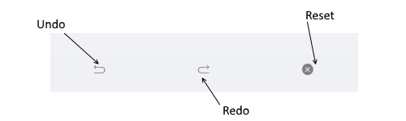

# History



The RadImageEditor Toolbar provides the following Toolbar Items for reversing and re-applying actions:

* **UndoToolbarItem**: Undoes the last executed action on the image editor.
* **RedoToolbarItem**: Redoes the last executed action on the image editor.
* **ResetToolbarItem**: Undoes all executed actions on the image editor. This effectively resets the image to its initial state.

You could apply the following properties for the toolbar items above:

* **ApplyToolbarItem**: Applies the changes from the currently active tool and deactivates it.
* **CancelToolbarItem**: Cancels the changes from the currently active tool and deactivates it.
* **TemplateToolbarItem**: Allows displaying an arbitrary content in the toolbar via a DataTemplate. The BindingContext of the created content is set to the currently active tool in the image editor. This allows direct data binding of the components from the template to the properties of the tool. The TemplateToolbarItem exposes the following property:
	* **Template**(*DataTemplate*): Specifies the DataTemplate of the content to be displayed.

## Example

```XAML
<telerikImageEditor:RadImageEditorToolbar Grid.Row="1" ImageEditor="{x:Reference imageEditor}" AutoGenerateItems="False">
    <telerikImageEditor:UndoToolbarItem/>
    <telerikImageEditor:RedoToolbarItem/>
    <telerikImageEditor:ResetToolbarItem/>
</telerikImageEditor:RadImageEditorToolbar>
```

## See Also

- [Image Transformations]()
- [Effects]()
