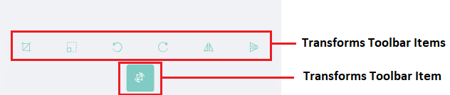
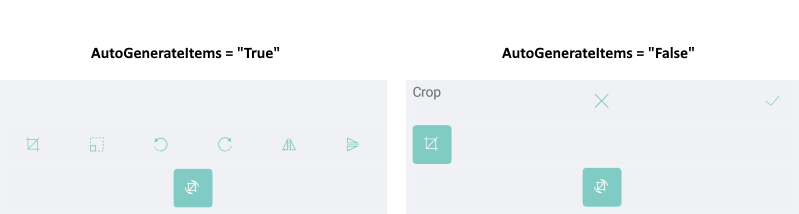
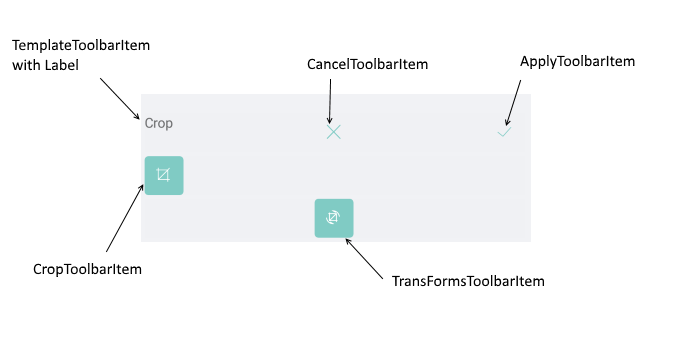

# Image Transformations



The RadImageEditor Toolbar allows you to transform the image through the following **Transforms** Toolbar Items:

* **CropToolbarItem**: Activates the crop tool in the image editor that allows you to crop the image.
* **ResizeToolbarItem**: Activates the resize tool in the image editor that allows you to resize the image.
* **RotateLeftToolbarItem**: Executes an action on the image editor to rotate the image 90 degrees to the left (counter clockwise direction).
* **RotateRightToolbarItem**: Executes an action on the image editor to rotate the image 90 degrees to the right (clockwise direction).
* **FlipHorizontalToolbarItem**: Executes an action on the image editor to flip the image horizontally.
* **FlipVerticalToolbarItem**: Executes an action on the image editor to flip the image vertically.

>tip To group the transformations you could use the common ToolbarItem: TransformsToolbarItem. By default when the TransformsToolbarItem is set to the ImageEditorToolbarItem, the value of the AutoGenerateItems is true. In case you want to customize the TransformsToolbarItem you should set the AutoGenerateItems to false. 

You could apply the following properties for each Transform Toolbar Item

* **ApplyToolbarItem**: Applies the changes from the currently active tool and deactivates it.
* **CancelToolbarItem**: Cancels the changes from the currently active tool and deactivates it.
* **TemplateToolbarItem**: Allows displaying an arbitrary content in the toolbar via a DataTemplate. The BindingContext of the created content is set to the currently active tool in the image editor. This allows direct data binding of the components from the template to the properties of the tool. The TemplateToolbarItem exposes the following property:
	* **Template**(*DataTemplate*): Specifies the DataTemplate of the content to be displayed.



## Example

Example when AutoGenerateItems="True"

```XAML
<telerikImageEditor:RadImageEditorToolbar Grid.Row="1" ImageEditor="{x:Reference imageEditor}" AutoGenerateItems="False">
    <telerikImageEditor:EffectsToolbarItem AutoGenerateItems="True"/>
</telerikImageEditor:RadImageEditorToolbar>
```

Example when AutoGenerateItems="False". 

```XAML
<telerikImageEditor:RadImageEditorToolbar Grid.Row="1" ImageEditor="{x:Reference imageEditor}" AutoGenerateItems="False">
    <telerikImageEditor:TransformsToolbarItem AutoGenerateItems="False">
        <telerikImageEditor:CropToolbarItem AutoGenerateItems="False" HorizontalOptions="Start">
            <telerikImageEditor:TemplateToolbarItem HorizontalOptions="Start">
                <telerikImageEditor:TemplateToolbarItem.Template>
                    <DataTemplate>
                        <Label Text="Crop"/>
                    </DataTemplate>
                </telerikImageEditor:TemplateToolbarItem.Template>
            </telerikImageEditor:TemplateToolbarItem>
            <telerikImageEditor:CancelToolbarItem HorizontalOptions="Center"/>
            <telerikImageEditor:ApplyToolbarItem HorizontalOptions="End"/>
        </telerikImageEditor:CropToolbarItem>
    </telerikImageEditor:TransformsToolbarItem>
</telerikImageEditor:RadImageEditorToolbar>
```

Visual Structure of the EffectsToolbarItem when AutoGenerateItems = "False" 



## See Also

- [Effects]()
- [History]()

