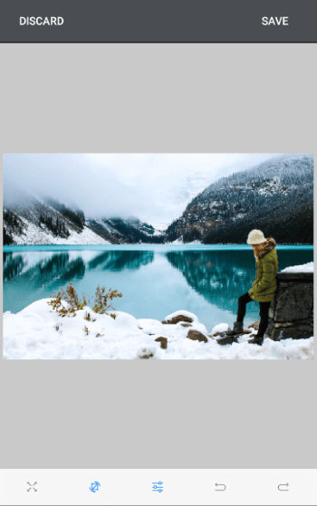

# Overview #

**RadImageEditor for Xamarin** is a control that enables you to easily visualize and edit images in different file formats in your mobile application. As an addition to the RadImageEditor control you can use an UI - RadImageEditorToolbar that allows you to easily edit image without manually executing a different tool.

#### Figure 1: RadImageEditor Overview

## Key features

* **Importing and Exporting images**: RadImageEditor allows you to import and export different image formats such as **JPEG, PNG, GIF, BMP**.
* **Various image source options**: The control could load images from a Stream, File (as embedded resource, or image located on the device) and URI.
* **Rich image editing features set**: The control comes with a bunch of tools that apply different effects to the loaded image. These tools include
	* **Crop**
	* **Resize**
	* **Hue Shift**
	* **Saturation**
	* **Flip**
	* **Contrast**
	* **Rotations** and many more. For more details check the Tools article.
* **Support for undo/redo**: RadImageEditor has a history stack with the changes applied to the image. This means that you can reverse and re-apply actions. Read more about this in the History article.
* **RadImageEditorToolbar** *(Built-in Toolbar Items)*: You could take advantage of a pre-defined UI automatically wired with all toolbar items provided by the control through built-in functionality.
* **Custom Toolbar**: The RadImageEditor Toolbar can be fully customized. You could populate the toolbar with the ToolbarItems needed for editing the image. 
* **Custom Commands**: The control provides and API for adding custom commands to the Toolbar. Check here for more details.

## See Also
