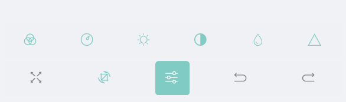

# ImageEditor Toolbar

The RadImageEditor control comes with various editing capabilities and with the help of the **ImageEditorToolbar** you can provide to the users easy and quick way to edit their images. The default toolbar include items for all the available image editing options, alternatively you could customize the shown editing options according to your needs.

By default the RadImageEditorToolbar Items are auto-populated. You could change this by setting the RadImageEditorToolbar boolean **AutoGenerateItems** to *False*. In this case you will need to manually define the available editing options, for more details check [Custom Toolbar]() article.

In order to attach the ImageEditor control to the RadImageEditorToolbar control you need to set the **ImageEditor**(from type *RadImageEditor*) property. All toolbar items execute their actions against the specified image editor.

When the ImageEditorToolbarItems can not be fitted in the device screen, OverflowButton is shown in the toolbar. You could customize it through the following properties:

* **IsMultiLine**(*bool*): Defines a value indicating whether the display nested levels of toolbar items on multiple lines. When set to true, nested levels of toolbar items are displayed on separate lines in the toolbar. When set to false, nested levels of toolbar items are displayed on a single line in the toolbar, whith the option to navigate back and forward between the different levels. By default is false.
* **OverflowButtonText**(*String*): Specifies the text of the overflow button. 
* **OverflowButtonTextColor**(*Color*): Specifies the text color of the overflow button, which is displayed when there are more buttons than currently visible.
* **OverflowButtonFontFamily**(*String*): Specifies the font family of the overflow button, which is displayed when there are more buttons than currently visible.
* **OverflowButtonTemplate**(*DataTemplate*): Specifies the template of the overflow button, which is displayed when there are more buttons than currently visible.

## Example

Here is an example how to use the default RadImageEditor Toolbar and its properties:

Use the following snippet to define the RadImageEditor and RadImageEditor Toolbar:

<snippet id='imageeditor-getting-started-xaml'/>

In addition to this, you need to add the following namespace:

<snippet id='xmlns-telerikimageeditor'/>

This is the result:

This is the result when **IsMultiLine = "True"**:

## See Also

- [Custom Toolbar]()
- [Effects]()
- [Image Transformations]()
- [Toolbar Styling]()