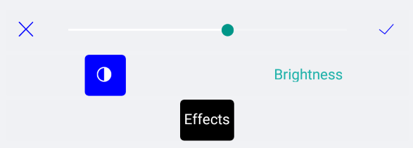

# ImageEditor ToolbarItems Styling

The RadImageEditor Toolbar Items could be styled when the Custom Toolbar is created. For more details how to apply custom Toolbar please check the [RadImageEditor Custom Toolbar]() article.

The following properties could be used for styling each item from the RadImageEditorToolbar:

* **Text**(*String*): Specifies the text for the concrete toolbar item.
* **TextColor**(*Color*): Defines the text color for the concrete toolbar item.
* **SelectedColor**(*Color*): Defines the tex color when the toolbar item is selected.
* **Font Options** (FontSize, FontFamily, FontAttributes): Defines the font options that are applied to the concrete ImageEditorToolbar Item.

## Example

Here is an example how to style the Custom RadImageEditorToolbar.

The snippet below shows how style the Custom ImageEditorToolbar:

```XAML
<Grid>
    <Grid.RowDefinitions>
        <RowDefinition />
        <RowDefinition Height="Auto" />
    </Grid.RowDefinitions>
    <telerikImageEditor:RadImageEditor x:Name="imageEditor">
        <telerikImageEditor:RadImageEditor.Source>
            <OnPlatform x:TypeArguments="ImageSource" Default="cat4.jpeg">
                <On Platform="UWP">Assets\cat4.jpeg</On>
            </OnPlatform>
        </telerikImageEditor:RadImageEditor.Source>
    </telerikImageEditor:RadImageEditor>
    <telerikImageEditor:RadImageEditorToolbar Grid.Row="1" ImageEditor="{x:Reference imageEditor}" AutoGenerateItems="False">
        <telerikImageEditor:EffectsToolbarItem AutoGenerateItems="False" Text="Effects" TextColor="Black" SelectedColor="White">
            <telerikImageEditor:ContrastToolbarItem AutoGenerateItems="False" TextColor="Blue">
                <telerikImageEditor:CancelToolbarItem HorizontalOptions="Start" TextColor="Blue" />
                <telerikImageEditor:TemplateToolbarItem TextColor="Blue">
                    <telerikImageEditor:TemplateToolbarItem.Template>
                        <DataTemplate>
                            <Slider Maximum="2" Minimum="0" Value="{Binding Value}" />
                        </DataTemplate>
                    </telerikImageEditor:TemplateToolbarItem.Template>
                </telerikImageEditor:TemplateToolbarItem>
                <telerikImageEditor:ApplyToolbarItem HorizontalOptions="End" TextColor="Blue"/>
            </telerikImageEditor:ContrastToolbarItem>
            <telerikImageEditor:BrightnessToolbarItem Text="Brightness" TextColor="LightSeaGreen" SelectedColor="Black"/>
        </telerikImageEditor:EffectsToolbarItem>
    </telerikImageEditor:RadImageEditorToolbar>
</Grid>
```

In addition to this, you need to add the following namespace:

<snippet id='xmlns-telerikimageeditor'/>

This is the result:



## See Also

- [Custom Toolbar]()
- [Effects]()
- [Image Transformations]()