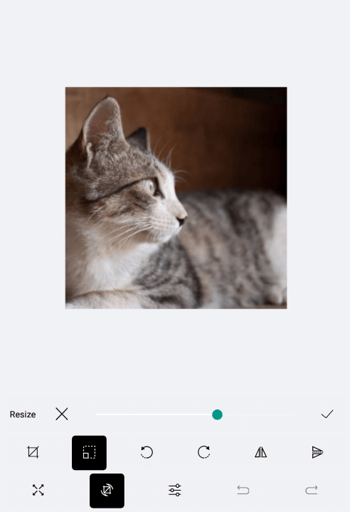

# ImageEditor Toolbar Styling

The RadImageEditor Toolbar could be styled through the Style property. You will need to declare the Style in the ResourceDictionary of the page and set for its TargetType property to be of type **telerikImageEditor:ImageEditorToolbarItem**.

>note In order to apply the style to all toolbar items you should set the *Style.ApplyToDerivedTypes* property to *True*.

You could style the Toolbar using the following properties:

* **ItemSpacing**(*double*): Specifies the extra spacing between items horizontal direction. The default value is 4.
* **TextColor**: Defines the color of all Toolbar items.
* **SelectedColor**: Defines the color of the selected Toolbar item.
* **BackgroundColor**: Defines the background color of all Toolbar items.
* **Font Options** (FontSize, FontFamily, FontAttributes): Defines the font options that are applied to all ImageEditorToolbar Items.

When the Toolbar Items are more than the device screen size can fit the OverflowButton is shown. It could be stylied through the following properties:

* **OverflowButtonText**(*String*): Specifies the text of the overflow button.
* **OverflowButtonTextColor**(*Color*): Specifies the text color of the overflow button, which is displayed when there are more buttons than currently visible.
* **OverflowButtonFontFamily**(*String*): Specifies the font family of the overflow button, which is displayed when there are more buttons than currently visible.
* **OverflowButtonTemplate**(*DataTemplate*): Specifies the template of the overflow button, which is displayed when there are more buttons than currently visible.

## Example

Here is an example how to style the RadImageEditor Toolbar.

The snippet below shows how the ImageEditor and the ImageEditorToolbar are defined:

```XAML
<Grid>
    <Grid.RowDefinitions>
        <RowDefinition />
        <RowDefinition Height="Auto" />
    </Grid.RowDefinitions>
    <telerikImageEditor:RadImageEditor x:Name="imageEditor">
        <telerikImageEditor:RadImageEditor.Source>
            <OnPlatform x:TypeArguments="ImageSource" Default="cat4.jpeg">
                <On Platform="UWP">Assets\cat4.jpeg</On>
            </OnPlatform>
        </telerikImageEditor:RadImageEditor.Source>
    </telerikImageEditor:RadImageEditor>
    <telerikImageEditor:RadImageEditorToolbar Grid.Row="1" ImageEditor="{x:Reference imageEditor}" />
</Grid>
```

Then add the Style in the Resources of the page :

```XAML
<ResourceDictionary>
    <Style TargetType="{x:Type telerikImageEditor:ImageEditorToolbarItem}" ApplyToDerivedTypes="True">
        <Setter Property="TextColor" Value="Black" />
        <Setter Property="FontSize" Value="14" />
        <Setter Property="SelectedColor" Value="White" />
    </Style>
</ResourceDictionary>
```

In addition to this, you need to add the following namespace:

<snippet id='xmlns-telerikimageeditor'/>

This is the result:



## See Also

- [Custom Toolbar]()
- [Effects]()
- [Image Transformations]()