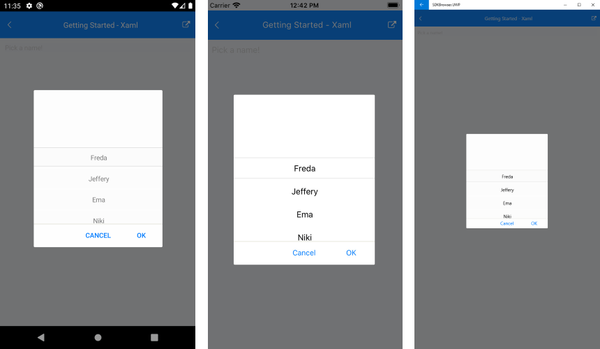

# Getting Started

This article will guide you through the steps needed to add a basic **RadListPicker** control in your application.

* [Setting up the app](#1-setting-up-the-app)
* [Adding the required Telerik references](#2-adding-the-required-telerik-references)
* [Adding RadListPicker control](#3-adding-radlistpicker-control)

## 1. Setting up the app

Take a look at these articles and follow the instructions to setup your app:

- [Setup app with Telerik UI for Xamarin on Windows]()
- [Setup app with Telerik UI for Xamarin on Mac]()

## 2. Adding the required Telerik references

You have two options:

* Add the Telerik UI for Xamarin Nuget packages following the instructions in [Telerik NuGet package server]() topic.

* Add the references to Telerik assemblies manually, check the list below with the required assemblies for **RadListPicker** component:

| Platform | Assemblies |
| -------- | ---------- |
| Portable | Telerik.XamarinForms.Common.dll<br/>Telerik.XamarinForms.Primitives.dll |
| Android  | Telerik.Xamarin.Android.Common.dll<br/>Telerik.Xamarin.Android.Primitives.dll<br/>Telerik.XamarinForms.Common.dll<br/>Telerik.XamarinForms.Primitives.dll |
| iOS      | Telerik.Xamarin.iOS.dll <br/>Telerik.XamarinForms.Common.dll<br/>Telerik.XamarinForms.Primitives.dll |
| UWP      | Telerik.Core.dll<br/>Telerik.UI.Xaml.Primitives.UWP.dll<br/>Telerik.XamarinForms.Common.dll<br/>Telerik.XamarinForms.Primitives.dll |

## 3. Adding RadListPicker control

You could use one of the following approaches:

#### Drag the control from the Toolbox. 

Take a look at the following topics on how to use the toolbox:

* [Telerik UI for Xamarin Toolbox on Windows]()
* [Telerik UI for Xamarin Toolbox on Mac]()
	
#### Create the control definition in XAML or C#.

The snippet below shows a simple RadListPicker definition:

<snippet id='accordion-getting-started-xaml' />
<snippet id='accordion-gettingstarted-csharp' />

In addition to this, you need to add the following namespace:

```XAML
xmlns:telerikBusyIndicator="clr-namespace:Telerik.XamarinForms.Primitives;assembly=Telerik.XamarinForms.Primitives"
xmlns:telerikInput="clr-namespace:Telerik.XamarinForms.Input;assembly=Telerik.XamarinForms.Input"
```
```C#
using Telerik.XamarinForms.Primitives;
using Telerik.XamarinForms.Input;
```

This is the result:



>important **SDK Browser** and **QSF** applications contain different examples that show RadDateTimePicker's main features. You can find the applications in the **Examples** and **QSF** folders of your local **Telerik UI for Xamarin** installation.

## See Also

- [Key Features]()
- [Custom Templates]()
- [Theming and Style]()
