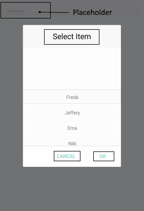

# List Picker Localization

RadDateTime Picker for Xamarin provides language localization. In short, you can translate the used across the List Picker texts to other languages, so that your app can be adapted to different regions.

>important To learn in details about the localization process of Telerik UI for Xamarin components, please go through the common [Localization and Globalization]() topic.

## ListPicker Localization Key

| Localization Key | Default Value |
| -----------------| ------------- |
| ListPicker_Popup_HeaderLabelText | Select Item |
| ListPicker_PlaceholderLabelText | Select Item |

## Common Picker Localizations strings

| Localization Key | Default Value |
| ---------------- | ------------- |
| Picker_Popup_AcceptButtonText | OK |
| Picker_Popup_CancelButtonText | Cancel |

Check in the image below how the common localization strings are presented in List Picker:

## See Also

* [Localization and Globalization]()
