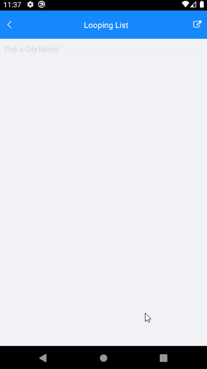

# Looping in List Picker for Xamarin

List Picker for Xamarin provides looping functionality which allows you to loop the list of items after reaching the last item.

You can achieve this by setting ListPicker **IsLooping**(*bool*) property to *true*.

## Example

The snippet below shows a simple RadListPicker definition:

<snippet id='listpicker-features-looping' />

A sample business model:

<snippet id='listpicker-features-businessmodel' />

and a ViewModel:

<snippet id='listpicker-features-viewmodel' />

This is how the Looping functionality looks:

>important A sample Looping example can be found in the ListPicker/Looping folder of the [SDK Samples Browser application](#sdk-browser-application).

## See Also

- [Templates]()
- [Styling]()
- [Selection]()
- [Commands]()
