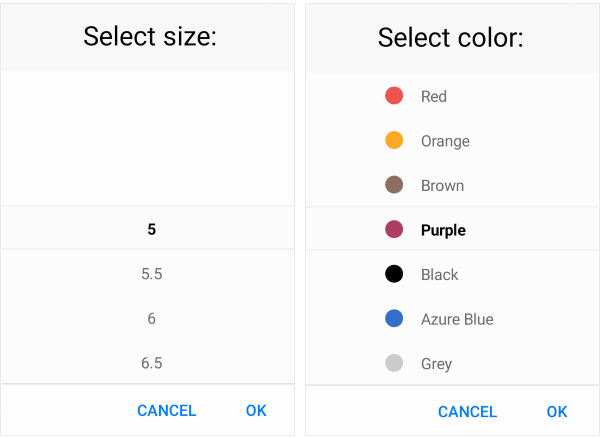

# Overview

**Telerik List Picker for Xamarin** allows you to select an item from a list of items. This list is visualized inside a popup. List Picker provides the ability to loop its items infinitly while scrolling. Also you can fully customize the dialog appearance, style the list items and define templates for the items and for the selected one.  

## Key features

* **Looping**: List Picker for Xamarin provides the ability to loop its items infinitly while scrolling. For more information in this go to [Looping]() article in our documentation.

* **Templates**: RadList Picker allows you to define a template for the list items and the selected one through the ItemTemplate and SelectedItemTemplate properties. To learn more about this, visit [Templates]() article.

* **Vizualized Text Formatting**: You can choose what text to display when an item from the list was picked through the Picker DisplayTextFormatter property. For more info on this check the Key Features - Display String section.

* **Customizable Items**:  Take advantage of the styling capabilities of RadList Picker by using its Style properties such as ItemStyle, SelectedItemStyle, etc.You can easily style its Spinners, the Popup and its header and footer. For more details check Styling article.

* **Commands Support**: RadPickerBase class exposes commands that allows you to clear the selected item - Clear Command and Toggle Command which allows you to open and close the dialog. More information about Commands support check our help article here.

>tip Check out RadList Picker [Getting Started]() help article that shows how to use it in a basic scenario.

## See Also

- [Getting Started]()
- [Looping]()
- [Templates]()
- [Styling]()