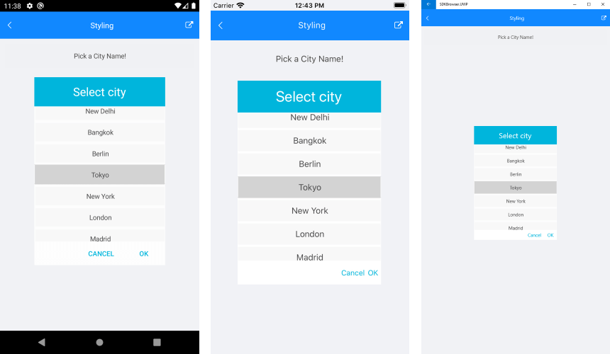

# Styling

List Picker for Xamarin provides the followind Style properties for customizing its look:

* **ItemStyle**(of type *Style* with target type **telerikDataControls:SpinnerItemView**): Defines the style applied to the list of items.
* **SelectedItemStyle**(of type *Style* with target type **telerikDataControls:SpinnerItemView**): Defines the style applied to the seledted item.
* **SelectionHighlightStyle**(of type *Style* with target type **telerikPrimitives:RadBorder**): Specifies the style applied to the border where the current selection is.  
* **PlaceholderLabelStyle**(of type *Style* with target type **Label**): Defines the style applied to the placeholder label.
* **DisplayLabelStyle**(of type *Style* with target type **Label**): Defines the style applied to the label which is visualized when item of the list is selected.
* **SelectorSettings**(*Telerik.XamarinForms.Input.PickerPopupSelectorSettings*).

Using the SelectorSettings property of the RadPickerBase class, you could style the dialog(popup) through the following properties:

* **PopupViewStyle**(of type *Style* with target type **telerikInput:PickerPopupContentView**): Defines the popup view style.
* **HeaderStyle**(of type *Style* with target type **telerikInput:PickerPopupHeaderView**): Defines the popup header style.
* **HeaderLabelStyle**(of type *Style* with target type **Label**): Defines the popup header label style.
* **FooterStyle**(of type *Style* with target type **telerikInput:PickerPopupFooterView**): Defines the popup footer style.
* **AcceptButtonStyle**(of type *Style* with target type **Button**): Defines the Accept button style.
* **CancelButtonStyle**(of type *Style* with target type **Button**): Defines the Cancel button style.

The SelectorSetting also provides the following properties for popup customization:

* **PopupOutsideBackgroundColor**(*Xamarin.Forms.Color*): Defines the color outside of the popup.
* **HeaderLabelText**(*string*): Specifies the text visualized in the popup header.
* **AcceptButtonText**(*string*): Defines the text visualized for the accept button. By default the text is *OK*.
* **CancelButtonText**(*string*): Defines the text visualized for the cancel button. By default the text is *Cancel*. 

## Namespaces

Using **ItemStyle**, **SelectedItemStyle** you need to add the following namespace:

```XAML
xmlns:dataControls="clr-namespace:Telerik.XamarinForms.DataControls;assembly=Telerik.XamarinForms.DataControls"
``` 

Using **PopupViewStyle**, **HeaderStyle**, **FooterStyle** add the followng namespace:

```XAML
xmlns:telerikInput="clr-namespace:Telerik.XamarinForms.Input;assembly=Telerik.XamarinForms.Input"
```

The **SelectionHighlightStyle** requires the following namespace:

```XAML
xmlns:telerikPrimitives="clr-namespace:Telerik.XamarinForms.Primitives;assembly=Telerik.XamarinForms.Primitives"
```

## Example

Here is a sample example that shows how the styling properties are applied.

A sample **List Picker** definition:

<snippet id='listpicker-features-styling' />

and here are how the styles are defined in the page resources

### Item Style

<snippet id='listpicker-features-itemstyle' />

## SelectedItem Style

<snippet id='listpicker-features-selecteditemstyle' />

### PlaceholderLabel Style

<snippet id='listpicker-style-placeholder-label-style' />

## DisplayLabel Style

<snippet id='listpicker-style-display-label-style' />

## PopupView Style

<snippet id='listpicker-style-popupview-style' />

## Header Style

<snippet id='listpicker-style-header-style' />

## HeaderLabel Style

<snippet id='listpicker-style-header-label-style' />

## FooterStyle

<snippet id='listpicker-style-footer-style' />

## AcceptButton Style

<snippet id='listpicker-style-accept-button-style' />

## CancelButton Style

<snippet id='listpicker-style-cancel-button-style' />

A sample business model:

<snippet id='listpicker-features-businessmodel' />

and a ViewModel:

<snippet id='listpicker-features-viewmodel' />

also you will need to add the following namespaces:

```XAML
xmlns:telerikInput="clr-namespace:Telerik.XamarinForms.Input;assembly=Telerik.XamarinForms.Input"
xmlns:telerikDataControls="clr-namespace:Telerik.XamarinForms.DataControls;assembly=Telerik.XamarinForms.DataControls"
```

This is how the List Picker looks when the styling properties are applied:



>important A sample Styling example can be found in the ListPicker/Features folder of the [SDK Samples Browser application]().

## See Also

- [Looping]()
- [Templates]()
