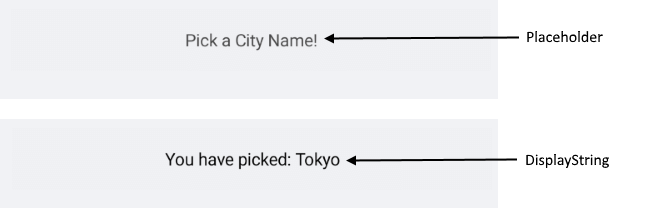

# Visual Structure

Here are described all visual elements used in the List Picker for Xamarin.

## List Picker Structure before and after an item is selected

## List Picker Popup Visual Structure

## Legend

- **Placeholder** 
- **DisplayStringFormat** 
- **HeaderLabelText**
- **Item**
- **SelectedItem**
- **Footer**