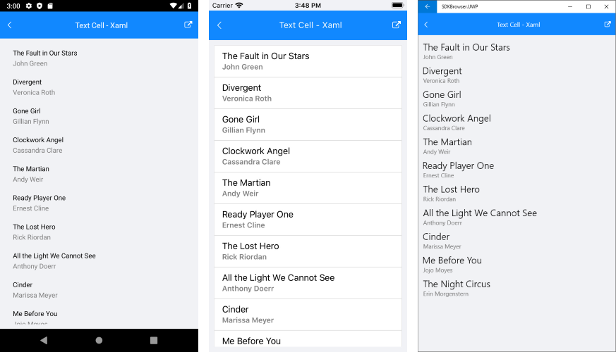
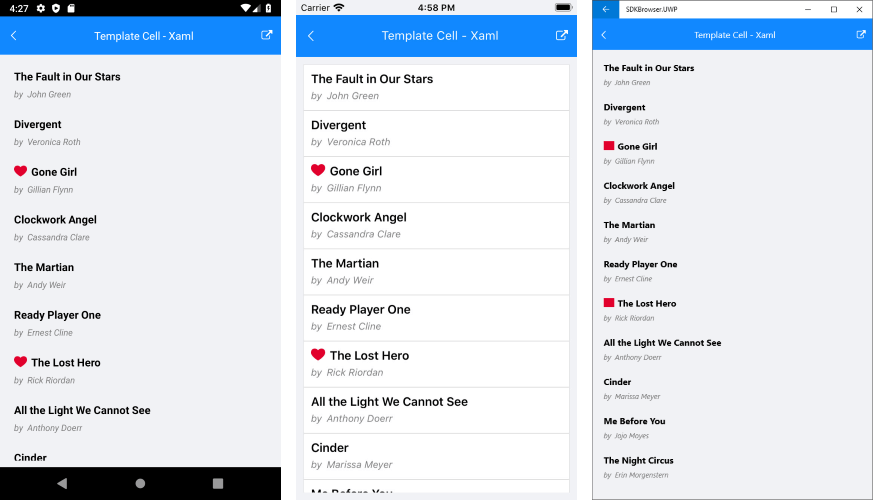

# ListView Cell Types
Cells are non-visual objects used to describe a template for creating a visual element inside each ListView item. There are two types of cells:

- **ListViewTextCell** derives from Xamarin.Forms.**TextCell** and displays text. It can optionally render detail text as a second row within a list view item. This is the default cell of the RadListView.
- **ListViewTemplateCell** derives from Xamarin.Forms.**ViewCell** and used to present complex data sets as RadListView.**ItemTemplate**.

## ListViewTextCell Example

This example demonstrates how to create a list view with text cells, like this:

1. Create a view model that will be the source of the list view:

    <snippet id='listview-celltypes-textcell-viewmodel'/>

1. Add the definition of the listview control:

    <snippet id='listview-celltypes-textcell-listview-xaml'/>

    <snippet id='listview-celltypes-textcell-listview-csharp'/>

1. Add the following namespaces:

    <snippet id='xmlns-teleriklistview'/>

    <snippet id='ns-teleriklistview'/>

1. Finally, set the list view as the content of your page.

## ListViewTemplateCell Example

This example demonstrates how to create a list view with templated cells, like this:

1. Create a view model that will be the source of the list view:

    <snippet id='listview-celltypes-templatecell-viewmodel'/>

1. Define the listview control either in Xaml or in code behind.

    - You can define the list view in Xaml like this:

        <snippet id='listview-celltypes-templatecell-listview-xaml'/>

        - Define the namespace

            <snippet id='xmlns-teleriklistview'/>

    - You can define the list view in code behind:

        - For clarity, let's build the template of the list view cell in a separate method:

            <snippet id='listview-celltypes-templatecell-cellcontent'/>

        - Define the list view:

            <snippet id='listview-celltypes-templatecell-listview-code'/>

1. Finally, set the list view as the content of your page.

## See Also
- [ListView Item TemplateSelector]()
- [ListView Layouts]()
- [Items Styling]()