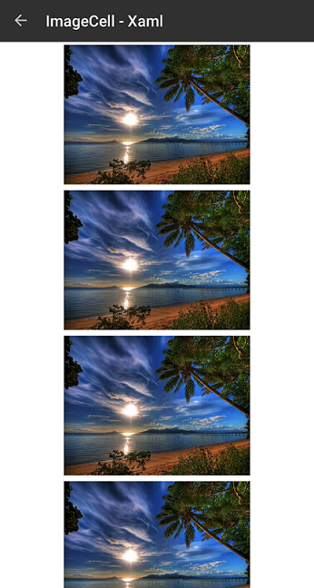

# ListView Cell Types
Cells are non visual objects used to describe a template for creating a visual element inside each RadListView item. There are three types of cells:

- **ListViewTextCell**: derives from Xamarin.Forms.**TextCell** and is meant to visualize text and optionally detail text rendered as second row inside list view item. This is the default cell of the RadListView.
- **ListViewImageCell**: derives from Xamarin.Forms.**ImageCell** is used to easily present images.
- **ListViewTemplateCell**: derives from Xamarin.Forms.**ViewCell** and is used to present complex data set as RadListView.**ItemTemplate**.

## ListViewTextCell Example

This example demonstrates how to create a RadListView with text cells, like this:


Let's create a view model that provides an ItemsSource for the RadListView.

<snippet id='listview-celltypes-textcell-viewmodel'/>

And here is the definition of the RadListView control:

<snippet id='listview-celltypes-textcell-listview-xaml'/>
<snippet id='listview-celltypes-textcell-listview-csharp'/>

Where:

<snippet id='xmlns-teleriklistview'/>
<snippet id='ns-teleriklistview'/>

Finally, set the RadListView as content of your page.

## ListViewImageCell Example

This example demonstrates how to create a RadListView with image cells, like this:



Let's create a view model that provides an ItemsSource for the RadListView.

<snippet id='listview-celltypes-imagecell-viewmodel'/>

And here is the definition of the RadListView control:

<snippet id='listview-celltypes-imagecell-listview-xaml'/>
<snippet id='listview-celltypes-imagecell-listview-csharp'/>

Where:

<snippet id='xmlns-teleriklistview'/>
<snippet id='ns-teleriklistview'/>

Finally, set the RadListView as content of your page.


## ListViewTemplateCell Example

This example demonstrates how to create a RadListView with templated cells, like this:


Let's create a view model that provides an ItemsSource for the RadListView.

<snippet id='listview-celltypes-templatecell-viewmodel'/>

### Definition in Xaml

You can define the RadListView in Xaml like this:

<snippet id='listview-celltypes-templatecell-listview-xaml'/>

Where:

<snippet id='xmlns-teleriklistview'/>

### Definition in code behind

For clarity, let's build the ```ListViewTemplateCell``` in a separate method:

<snippet id='listview-celltypes-templatecell-cellcontent'/>

You can define the RadListView in code like this:

<snippet id='listview-celltypes-templatecell-listview-code'/>

Finally, set the list view as content of your page.

## See Also
- [ListView Item TemplateSelector]()
- [ListView Layouts]()
- [Items Styling]()