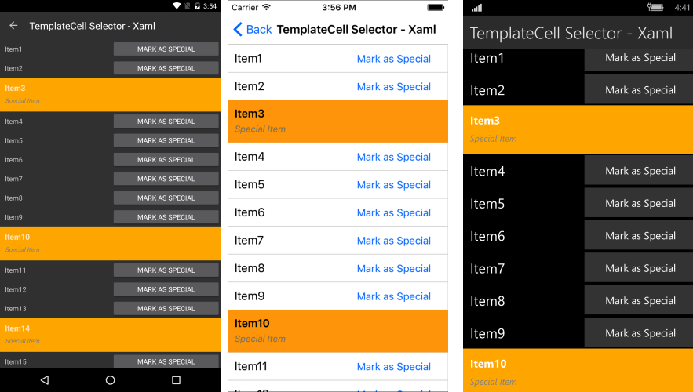

# ListView ItemTemplateSelector

The **RadListView** control exposes an **ItemTemplateSelector** property which you can use to apply different template to each item depending on a specific condition.  

This article will show you how you can utilize this property to achieve divergent appearance for the different items within your Telerik ListView control. 

## TemplateSelector Implementation

Let's assume you have a **RadListView** bound to a collection of multiple **DataItem** objects and the appearance of each item depends on a specific property of the business object. Below is the **DataItem** class definition:

<snippet id='listview-itemtemplateselector-dataitem'/>

The first step is to declare a simple **RadListView** and set its **ItemsSource** property to point to the collection of custom objects:

<snippet id='listview-itemtemplateselector-sourcecollection'/> 

Eventually, as you need to apply different template to the item based on the value of the **IsSpecial** property, you have to create a custom class that inherits from **DataTemplateSelector**. This class will return different **DataTemplate** according to whether the value is true or false:

<snippet id='listview-itemtemplateselector-customitemtemplateselector'/>

As a last step, you need to set this custom class as the **ItemTemplateSelector** property of the **RadListView** and customize the templates within it:

<snippet id='listview-itemtemplateselector-setting-itemtemplateselector'/>

Running the sample will lead to the following appearance of the control:

A full example that shows the scenario is available in the **SDK Samples Browser** application from your local installation.

## See Also

- [ListView Cells]()
- [ListView Layouts]()
- [Items Styling]()