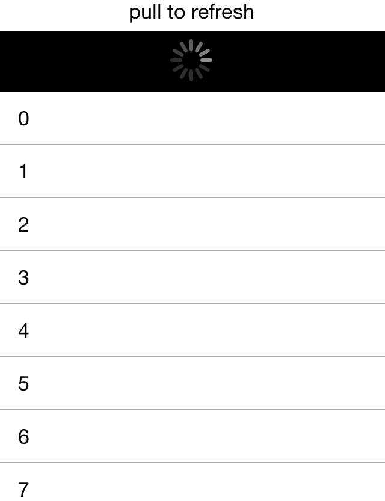

# Pull to Refresh

If the list contains items, which may change after the initial load, it may be good idea to allow users to refresh that list. **RadListView** is capable of doing this by a pull-to-refresh gesture. The feature allows the data to be refreshed by swiping finger down when the content is scrolled up to the top. This will trigger an animated activity indicator which will stay visible until data is refreshed.

This feature consists of:

1. **RadListView.IsPullToRefreshEnabled** - a boolean property which gets or sets a statement disabling or enabling the feature. The default value of the property is false.
2. **RadListView.RefreshRequested** - a public event which is triggered when the pull-to-refresh gesture is triggered. The custom data refreshing logic should be implemented in its handler.
3. **RadListView.EndRefresh()** - a public method which must be called when the custom data refreshing logic finishes executing.

Here is how the loading process looks like:

Figure 1: Pull to Refresh in iOS

Figure 2: Pull to Refresh in Android

