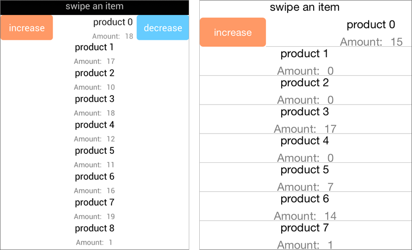

# Cell Swipe

The cell swipe feature allows end-users to use swipe gesture on cells. When the user swipes, the content view moves revealing a designated swipe background view where you can place custom views ready for interaction e.g. buttons, images etc.

Figure 1: Cell Swipe

This feature consists of the following properties:

1. **IsItemSwipeEnabled** - of type bool which turns on or off the feature. It's default value is false.
2. **SwipeThreshhold** - of type double which gets or sets the length (in pixels) of the swipe gesture which is required to trigger the feature. Any shorter swipe will not be respected. It's default value is 0.
3. **SwipeOffset** - of type Thickness which gets or sets how much the swiped cell will be moved to the side and stick there. It's default value is 100.
4. **ItemSwipeContentTemplate** - of type DataTemplate which gets or sets the content that will be visualized when users swipe a cell.

To enable this feature in a project the **IsItemSwipeEnabled** property of the RadListView should be set to **True**. 

In *Android* it is enough to set this property. It will force the swiped item to stick to the corresponding side. Visualizing the underlying SwipeContent.

In *iOS* however, the **SwipeThreshhold** property should be set to force the items to stick to the swiped side. This property represents the length of the swipe gesture in pixels that will visualize the DataTemplate defined as **ItemSwipeContentTemplate**. Any swipe less than this value will not trigger the Cell Swipe.
