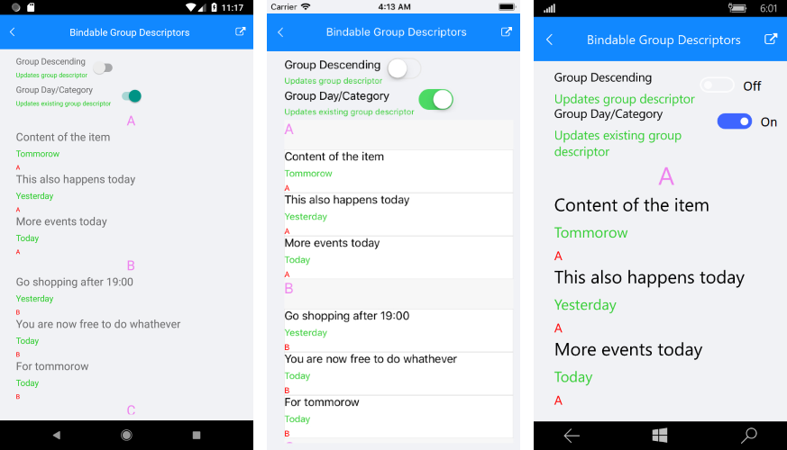
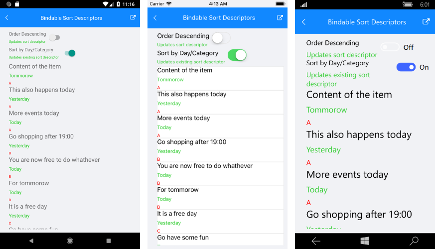
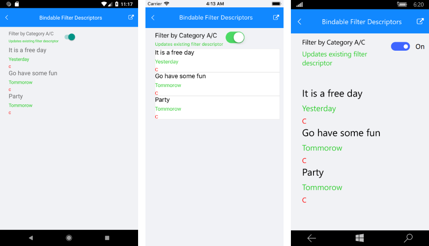

# Descriptors Collections

**RadListView** provides you with functionality to group, sort and filter its data. This can be achieved by using the already known [GroupDescriptors](), [SortDescriptors]() and [FilerDescriptors]() collections. Currently those descriptors of the RadListView support bingings. What's new is that now the users can control them using MVVM.

In order to control the descriptors collections through MVVM: 

 1. Add a specific using in your ViewModel class
 2. Use **OneWayToSource** binding

## Group Descriptors using MVVM

###Example

An example how to create a ListView with GroupDescriptors collection that can be controlled through MVVM can be found in the ListView/Bindable Collections folder of the [SDK Samples Browser application]().

Figure 1: Group Descriptors using MVVM

## Sort Desriptors

### Example

You can find a working demo labeled **Bindable Sort Descriptors** in the ListView/Bindable Collections folder of the [SDK Samples Browser application](). 

Figure 2: Sort Descriptors using MVVM

## Filter Descriptors

### Example 

[SDK Samples Browser application]() contais an example that shows FilterDescriptor collections in ListView controlled through MVVM. 

Figure 3: Filter Descriptors using MVVM

## See Also

- [Grouping]()
- [Sorting]()
- [Filtering]()
