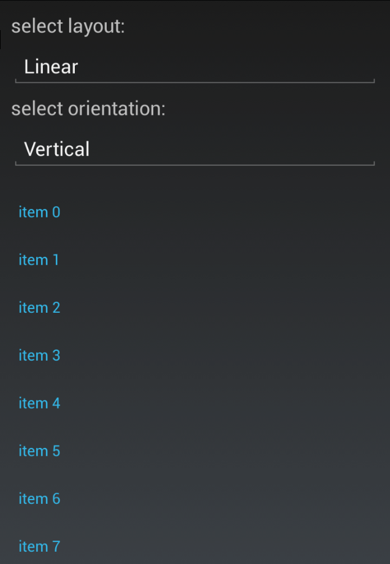
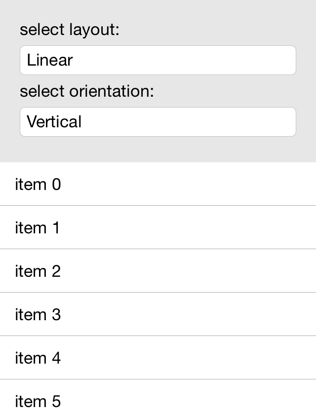
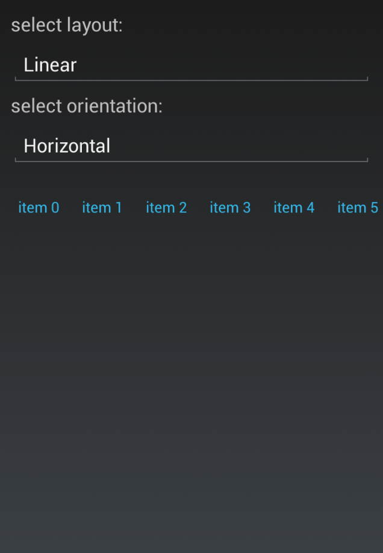
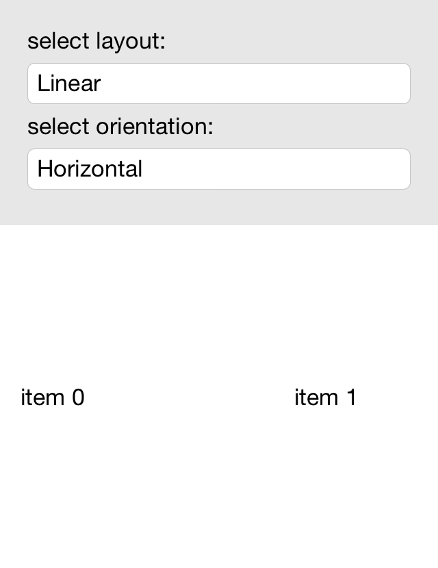
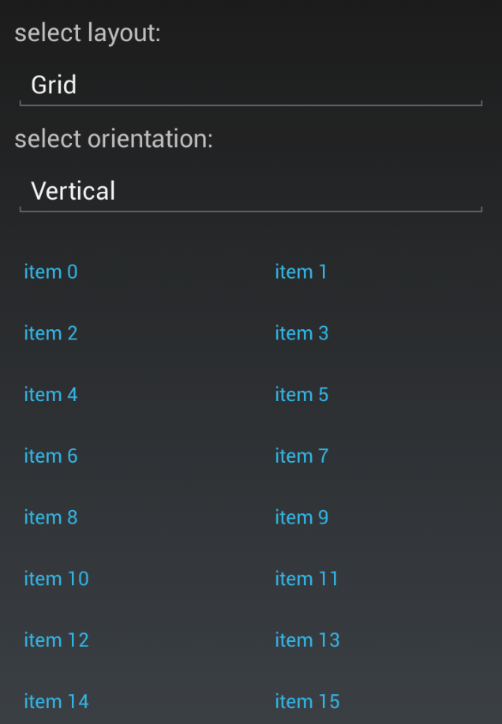
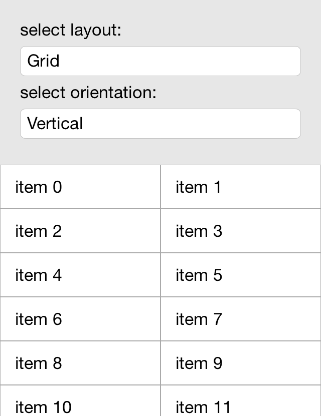
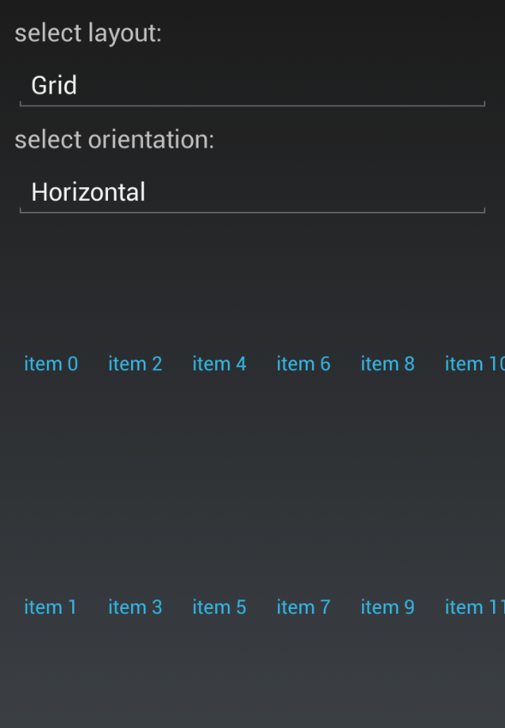
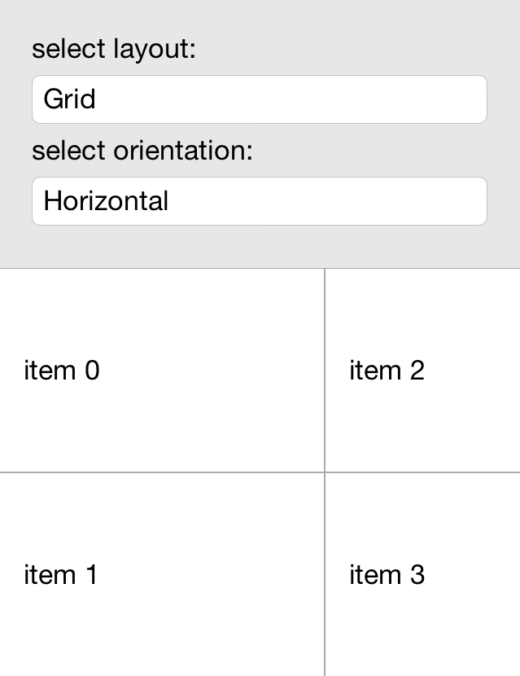

# Layouts

The **RadListView** component allows users to set either linear or grid layout definition. This can be done by changing the default setting of the **RadListView.LayoutDefinition**. This property is of type ListViewLayoutBase and gets or sets the layout of the control. 

## Common properties

Both layouts share common functionality in addition to the arrangement of the items. They allow users to control the size of the items and the spacing in between. Both layouts expose the following properties:

1. **VerticalItemSpacing** - a property of type double which gets or sets the vertical space between two items.
2. **HorizontalItemSpacing** - a property of type double which gets or sets the horizontal space between two items.
3. **ItemLength** - a property of type double which gets or sets the width or height (depending on the layout orientation) of the items. Its default value is -1 which means that the items will be sized according to the targeted platform.
4.

## Linear Layout

Linear layout is the default layout of the control. It can be explicitly set by creating an instance of the **ListViewLinearLayout** class and assigning it to the **RadListView.LayoutDefinition** property. In addition to the layout itself users can also change it's orientation. This can be done by changing the **ListViewLinearLayout.Orientation** property. It is of type *Orientation* enum and gets or sets the orientation either to *Vertical* or *Horizontal*.

Here is how the linear layouts look like:

Figure 1: Linear Vertical Layout in Android

Figure 2: Linear Vertical Layout in iOS

Figure 3: Linear Horizontal Layout in Android

Figure 4: Linear Horizontal Layout in iOS

## Grid Layout

The Grid Layout is an alternative layout provided by the **RadListView** out of the box. It allows distributing cells in a fixed number of columns/rows. It can be utilized by setting the **RadListView.LayoutDefinition** property to a new instance of the **ListViewGridLayout** class. It's orientation can also be changed by setting the **ListViewGridLayout.Orientation** property to either *Orientation.Vertical* or *Orientation.Horizontal*.

Here is how the Grid Layout looks like:

Figure 5: Grid Vertical Layout in Android

Figure 6: Grid Vertical Layout in iOS

Figure 7: Grid Horizontal Layout in Android

Figure 8: Grid Horizontal Layout in iOS

