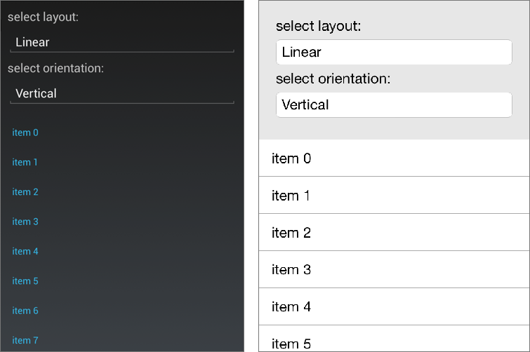
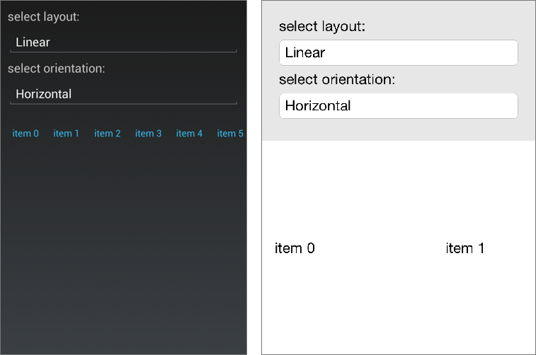
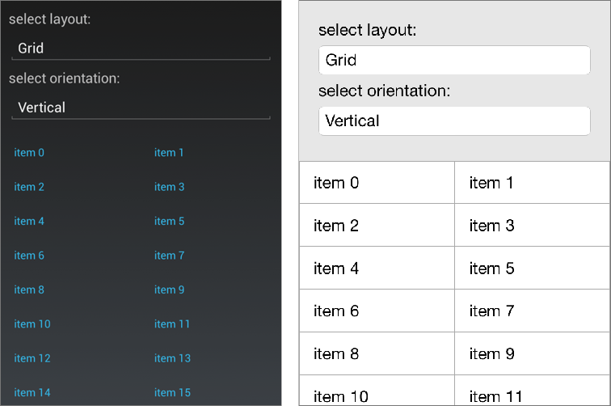
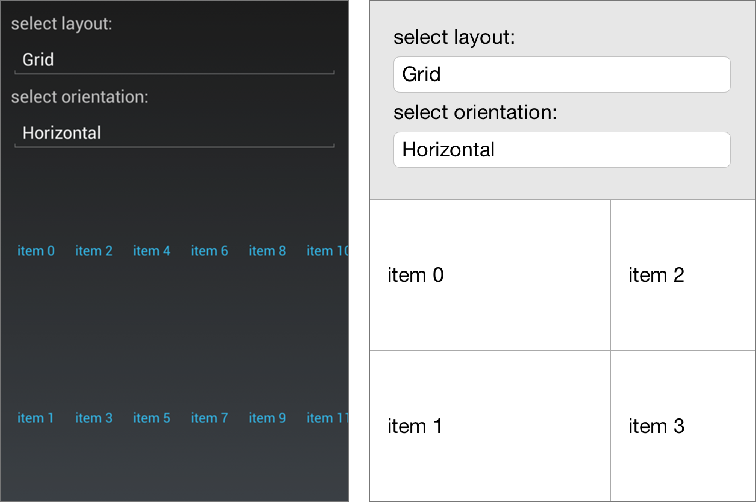

# Layouts

The **RadListView** component allows users to set either linear or grid layout definition. This can be done by changing the default setting of the **RadListView.LayoutDefinition**. This property is of type ListViewLayoutBase and gets or sets the layout of the control. 

## Common properties

Both layouts share common functionality in addition to the arrangement of the items. They allow users to control the size of the items and the spacing in between. Both layouts expose the following properties:

- **VerticalItemSpacing** (double): Gets or sets the vertical space between two items.
- **HorizontalItemSpacing** (double): Gets or sets the horizontal space between two items.
- **ItemLength** (double): Gets or sets the width or height (depending on the layout orientation) of the items. The default value is -1 which means that the items will be sized according to the targeted platform default behavior.
- **GroupHeaderLength** (double): Gets or sets the width or height (depending on the layout orientation) of the group headers. The default value is -1 which means that the items will be sized according to the targeted platform default behavior.
- **Orientation** (Orientation): Gets or sets a value describing how the list should be visualized.

## Linear Layout

Linear layout is the default layout of the control. It can be explicitly set by creating an instance of the **ListViewLinearLayout** class and assigning it to the **RadListView.LayoutDefinition** property.

Here is how the linear layouts look like:

Figure 1: Linear Vertical Layout (default layout)

	<telerikDataControls:RadListView/>

Figure 2: Linear Horizontal Layout
	
	<telerikDataControls:RadListView>
		<telerikDataControls:RadListView.LayoutDefinition>
			<list:ListViewLinearLayout Orientation="Horizontal"/>
		</telerikDataControls:RadListView.LayoutDefinition>
	</telerikDataControls:RadListView>

## Grid Layout

The Grid Layout is an alternative layout provided by the **RadListView** out of the box. It allows distributing cells in a fixed number of columns/rows. In addition to the properties of the linear layout it exposes the **SpanCount** property. It is of type **int** and gets or sets the count of the Columns/Rows (depending on the orientation) of the list. 

The grid layout can be utilized by setting the **RadListView.LayoutDefinition** property to a new instance of the **ListViewGridLayout** class.

Here is how the Grid Layout looks like:

Figure 3: Grid Vertical Layout

	<telerikDataControls:RadListView x:Name="list">
		<telerikDataControls:RadListView.LayoutDefinition>
			<list:ListViewGridLayout />
		</telerikDataControls:RadListView.LayoutDefinition>
	</telerikDataControls:RadListView>

Figure 4: Grid Horizontal Layout

	<telerikDataControls:RadListView x:Name="list">
		<telerikDataControls:RadListView.LayoutDefinition>
			<list:ListViewGridLayout Orientation="Horizontal"/>
		</telerikDataControls:RadListView.LayoutDefinition>
	</telerikDataControls:RadListView>

Figure 5: Grid Vertical Layout with 3 columns

	<telerikDataControls:RadListView x:Name="list">
		<telerikDataControls:RadListView.LayoutDefinition>
			<list:ListViewGridLayout SpanCount="3"/>
		</telerikDataControls:RadListView.LayoutDefinition>
	</telerikDataControls:RadListView>

