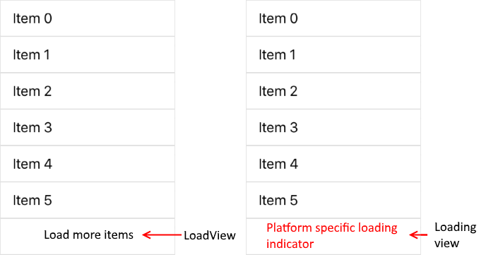

# Load on demand

With our 2016 R3 official release we introduced new items loading mechanism. This mechanism allows the developer to load items into the RadListView component only when the end-user wants to see more. It can serve to reduce the intial loading time by loading a few items at startup (ensuting fast loading) and add additional items at runtime (on a user request). On the following picture customers can see how the feature looks like with its default templates.

The load view is visualized when the feature is configured to be triggered manually and the end user scrolls to the end of the RadListView. The default load view is a button which triggers the custom item loading logic. The loading view is visualized while the custom item loading logic is ongoing. This view is also visualized in automatic mode when the end user scrolls to the end of the list.

# API

The LoadOnDemand API consist of:

* **IsLoadOnDemandEnabled** (bool): Gets or sets a boolean value indicating if the feature is enabled or not.
* **IsLoadOnDemandActive** (bool): Gets or sets a boolean value indicating if the items loading logic is currently working. This property should be set to False once the custom logic completes loading. 
* **LoadOnDemandMode** (LoadOnDemandMode): Gets or sets how the end-user will be able to request additional items
	* **Manual**: The RadListView will visualize a button like items after the last cell of its ItemsSource. The end-user will be able to tap it in order to request additional items.
	* **Automatic**: The RadListView will automatically trigger the items loading logic whenever there are 5 or less available items outside the viewport of the control.
* **LoadOnDemandItemTemplate** (DataTemplate): Gets or sets a description of the visual representation of the button like item.
* **LoadingOnDemandItemTemplate** (DataTemplate): Gets or sets a description of the visual representation of the data loading indicator.
* **LoadOnDemand** (event): triggered once when the end-user request more items.
* **ListViewLoadOnDemandCollection** (ObservableCollection&lt;object&gt;): Gets or sets the custom item loading logic.
	

# Event reliant implementation

It is important to keep in mind that using the **LoadOnDemand** event is a syncrinus way to implement this feature. In its event handler developers can load additional items directly into the **RadListView.ItemsSource** collection. There is no limitation nor requirement of the number of items that should be loaded. This event will be triggered once, every time the end-user requests additional items. Triggering this event also changes the special view displayed as last item.
Here is a simple implementation that can be used to get started.

#### C&#35;

	public partial class LoadOnDemandEvent : ContentPage
    {
        private int lodTriggerCount = 0;
        public LoadOnDemandEvent()
        {
            InitializeComponent();
            var source = new ObservableCollection<string>();
            foreach (string item in Enum.GetNames(typeof(DayOfWeek)))
            {
                source.Add(item);
            }
            this.listView.ItemsSource = source;
        }

        protected override void OnAppearing()
        {
            this.listView.LoadOnDemand += ListView_LoadOnDemand;
        }

        private void ListView_LoadOnDemand(object sender, EventArgs e)
        {
            this.lodTriggerCount++;
            foreach (string item in Enum.GetNames(typeof(DayOfWeek)))
            {
                (listView.ItemsSource as ObservableCollection<string>).Add(string.Format("LOD: {0} - {1}", lodTriggerCount, item));
            }
        }
    }
	
#### XAML

	<telerikDataControls:RadListView x:Name="listView" IsLoadOnDemandEnabled="True" LoadOnDemandMode="Manual" ItemsSource="{Binding Source}">
      <telerikDataControls:RadListView.ItemTemplate>
        <DataTemplate>
          <telerikListView:ListViewTemplateCell>
            <telerikListView:ListViewTemplateCell.View>
              <Grid HeightRequest="120">
                <Label Text="{Binding }" FontSize="24" TextColor="Black"  HorizontalOptions="Center" VerticalOptions="Center"/>
              </Grid>
            </telerikListView:ListViewTemplateCell.View>
          </telerikListView:ListViewTemplateCell>
        </DataTemplate>
      </telerikDataControls:RadListView.ItemTemplate>
    </telerikDataControls:RadListView>
	
Where the namespaces are defined like this:
	
	 xmlns:telerikDataControls="clr-namespace:Telerik.XamarinForms.DataControls;assembly=Telerik.XamarinForms.DataControls"
	 xmlns:telerikListView="clr-namespace:Telerik.XamarinForms.DataControls.ListView;assembly=Telerik.XamarinForms.DataControls"

# Collection reliant implementation

This approach is an MVVM friendly implementation of the same feature. Developers are allowed to provide a special collection as ItemsSource of the RadListView component. This collection should implement the ISupportLoadOnDemand interface. It contains the following members:
	
* **LoadOnDemandAction** (Func&lt;CancellationToken, IEnumerable&lt;object&gt;&gt;) - Gets the function wrapping the custom items loading logic.
* **LoadItemsOnDemand()** (void) - a method that triggers the items loading logic.
	
Once a custom collection implements the interface, the RadListView will be to trigger the custom item loading logic and the developer will be able to cancel his/her async taks through the RadListView.IsLoadOnDemandActive property. The most important advantage of this particular approach is that it allows asyncronus loading of items. Here is a sample which will get you started:

#### XAML

	<Grid BackgroundColor="White">
	<Grid.RowDefinitions>
	  <RowDefinition Height="*"/>
	  <RowDefinition Height="Auto"/>
	</Grid.RowDefinitions>
	<telerikDataControls:RadListView x:Name="listView" IsLoadOnDemandEnabled="True" LoadOnDemandMode="Automatic" ItemsSource="{Binding TelerikSource}">
	  <telerikDataControls:RadListView.ItemTemplate>
		<DataTemplate>
		  <telerikListView:ListViewTemplateCell>
			<telerikListView:ListViewTemplateCell.View>
			  <Grid HeightRequest="120">
				<Label Text="{Binding }" FontSize="24" TextColor="Black" HorizontalOptions="Center" VerticalOptions="Center"/>
			  </Grid>
			</telerikListView:ListViewTemplateCell.View>
		  </telerikListView:ListViewTemplateCell>
		</DataTemplate>
	  </telerikDataControls:RadListView.ItemTemplate>
	</telerikDataControls:RadListView>
	<Button Grid.Row="1" Text="Cancel LOD" HorizontalOptions="CenterAndExpand" Clicked="Cancel_LOD" />
	</Grid>
  
Where the namespaces are defined like this:

	xmlns:telerikDataControls="clr-namespace:Telerik.XamarinForms.DataControls;assembly=Telerik.XamarinForms.DataControls"
 	xmlns:telerikListView="clr-namespace:Telerik.XamarinForms.DataControls.ListView;assembly=Telerik.XamarinForms.DataControls"
	
#### C&#35;

	public partial class LoadOnDemandCollection : ContentPage
    {
        public LoadOnDemandCollection()
        {
            InitializeComponent();
            this.BindingContext = new TelerikViewModel();
        }

        public void Cancel_LOD(object sender, EventArgs e)
        {
            this.listView.IsLoadOnDemandActive = false;
        }
    }
	
Where the TelerikViewModel class is defined like this:

	public class TelerikViewModel
    {
        public ListViewLoadOnDemandCollection TelerikSource { get; set; }
        private int lodTriggerCount;
        public TelerikViewModel()
        {
            this.TelerikSource = new ListViewLoadOnDemandCollection((cancelationToken) => 
            {
                List<string> result = new List<string>();

                try
                {
                    //simulates connection latency
                    Task.Delay(4000, cancelationToken).Wait();

                    this.lodTriggerCount++;
                    foreach (string item in Enum.GetNames(typeof(DayOfWeek)))
                    {
                        result.Add(string.Format("LOD: {0} - {1}", lodTriggerCount, item));
                    }
                    return result;
                }
                catch (Exception ex)
                {
                    //exception is thrown when the task is canceled. Returning null does not affect the ItemsSource.
                    return null;
                }
            });

            foreach (string item in Enum.GetNames(typeof(DayOfWeek)))
            {
                TelerikSource.Add(string.Format(item));
            }
        }
    }
	
## See Also

[Pull to refresh]()

[Cell swipe]()

[Selection]()