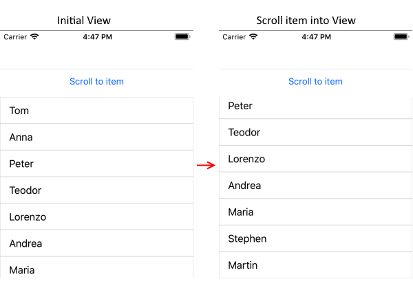

# Programmatic Scrolling

&nbsp;

RadListView exposes the following methods for programmatic scrolling to a specific data item: 

* **ScrollItemIntoView(object item)**: Attempts to bring the specified data item into the view.

Let's, for example, have a RadListView with ItemsSource bound to a list of names:

### Example

	<telerikDataControls:RadListView x:Name="listView" ItemsSource="{Binding Names}" />
	
In order to navigate to a concrete item, you would need to use __ScrollIntoView__ method as in the next snippet:

### Example

	listView.ScrollItemIntoView("Martin");
	
And the end result:

#### Figure 1: Scrolling item into View

	
##See Also

[Selection]()

[Grouping]()

[Reordering]()

