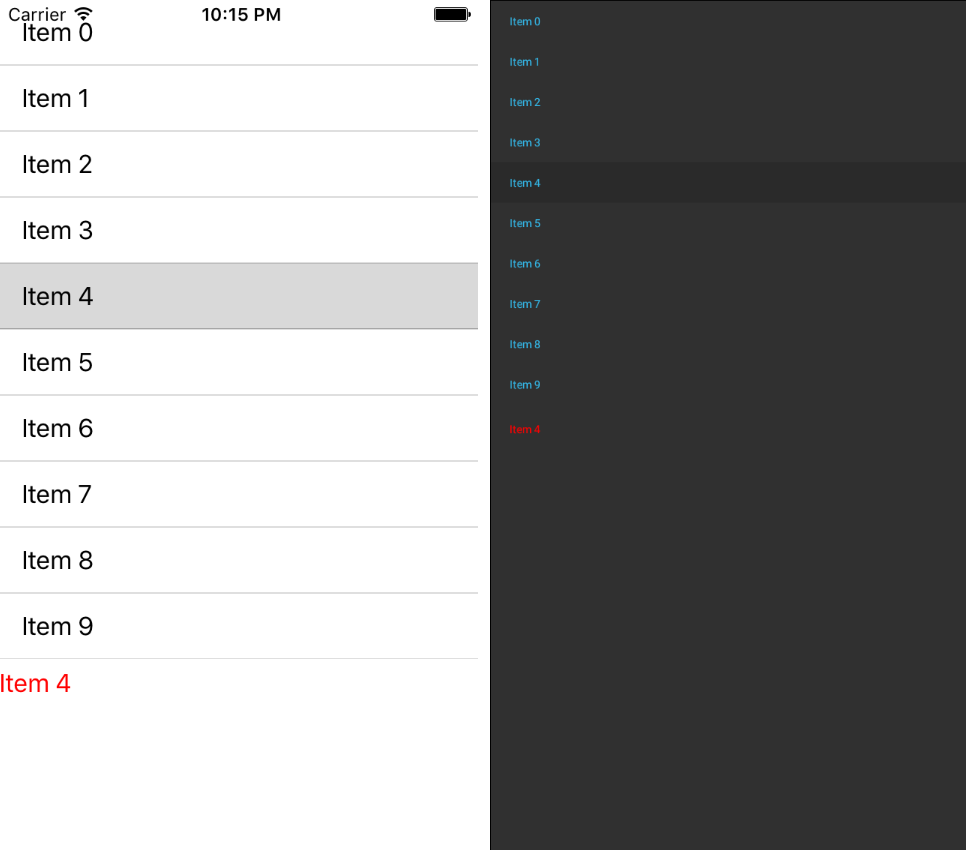
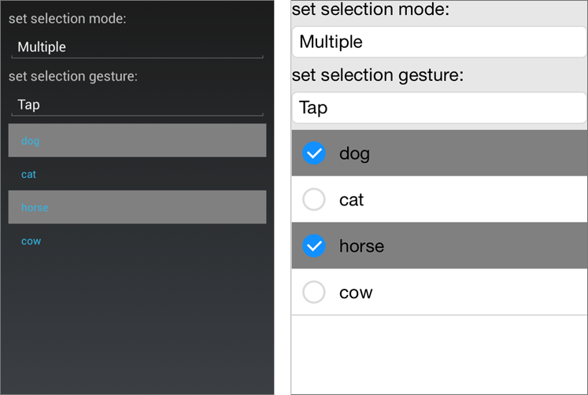

# Selection

The **RadListView** component exposes selection feature. It allows users to select one or many items out of the ItemsSource of the control. This feature provides both visual and programmatic feedback for the actions of the user. The following members are related to the selection: 

- **SelectionGesture** (SelectionGesture): Gets or sets the gesture triggering the selection. The available values are: **Tap**, **Hold**.
- **SelectionMode** (SelectionMode): Gets or sets the mode of the selection. The available values are: **None**, **Single**, **Multiple**.
- **SelectedItems** (ReadOnlyObservableCollection<object>): Holds the items that are currently selected.
- **SelectionChanged**: An event that is triggered whenever the SelectedItems collection is changed.

## Single Selection

This is the default selection mode. It allows users to select only one item. This is how it looks.

Figure 1: Single Selection

## Multiple Selection

To enable it the **SelectionMode** property should be set to **SelectionMode.Multiple**. This mode allows users to select more than one item. Here is how it looks.

Figure 2: Multiple Selection

