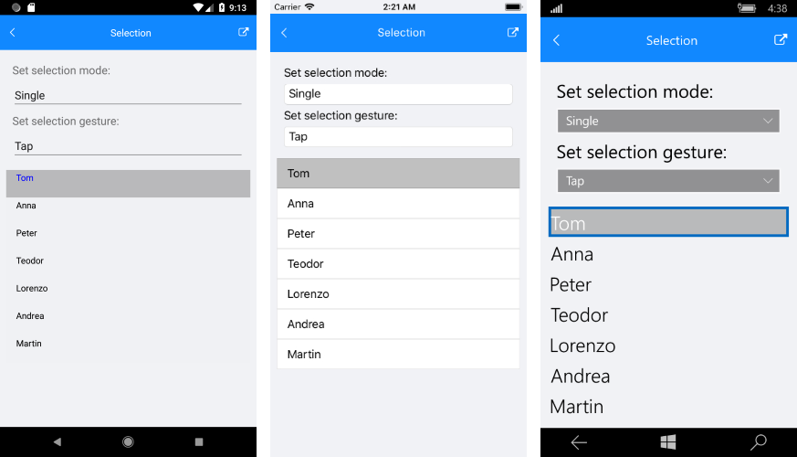
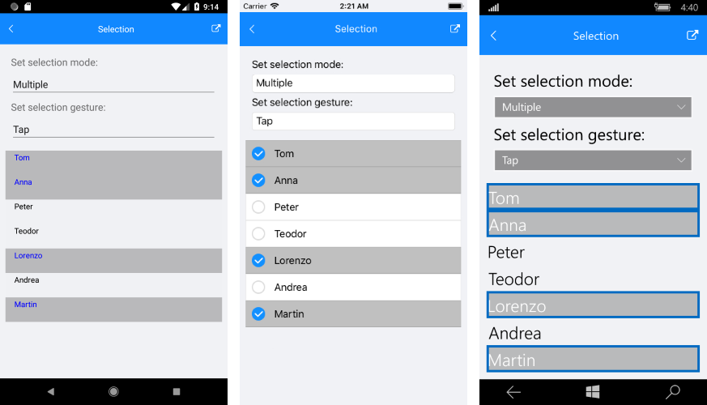

# Selection

The **RadListView** component exposes selection feature. It allows users to select one or many items out of the ItemsSource of the control. This feature provides both visual and programmatic feedback for the actions of the user. The following members are related to the selection: 

- **SelectionGesture** (*SelectionGesture*): Gets or sets the gesture triggering the selection.
	- Tap
	- Hold
- **SelectionMode** (*SelectionMode*): Gets or sets the mode of the selection.
	- None
	- Single
	- Multiple
- **SelectedItems** (*ObservableCollection&lt;object&gt;*): Gets or sets the currently selected items.
- **SelectedItem** (*object*): Gets the last selected item.
- **SelectionChanged**: An event that is triggered whenever the SelectedItems collection is changed.

## Single Selection

This is the default selection mode. It allows users to select only one item. This is how it looks.

Figure 1: Single Selection

## Example

#### XAML

	<StackLayout>
		<telerik:RadListView x:Name="list" SelectionMode="Single"></telerik:RadListView>
		<Label BindingContext="{x:Reference Name=list}" Text="{Binding SelectedItem}" TextColor="Red"/>
	</StackLayout>

#### C# 

    public Selection()
    {
        InitializeComponent();

        byte index = 0;
        var items = Enumerable.Repeat("Item ", 10).Select(i => i += index++).ToList<string>();
        this.list.ItemsSource = items;
        this.list.SelectedItems.Add(items[4]);
    }

## Multiple Selection

To enable it the **SelectionMode** property should be set to **SelectionMode.Multiple**. This mode allows users to select more than one item. Here is how it looks.

Figure 2: Multiple Selection

## Example

#### XAML

	<Grid>
		<Grid.RowDefinitions>
			<RowDefinition Height="Auto"/>
			<RowDefinition>
				<RowDefinition.Height>
					<OnPlatform x:TypeArguments="GridLength" iOS="130" Android="700"/>
				</RowDefinition.Height>
			</RowDefinition>
		</Grid.RowDefinitions>
		<telerik:RadListView x:Name="list" SelectionMode="Multiple"></telerik:RadListView>
		<ListView BindingContext="{x:Reference Name=list}" ItemsSource="{Binding SelectedItems}" Grid.Row="1" />
	</Grid>

#### C# 

    public Selection()
    {
        InitializeComponent();

        byte index = 0;
        var items = Enumerable.Repeat("Item ", 10).Select(i => i += index++).ToList<string>();
        this.list.ItemsSource = items;
        this.list.SelectedItems.Add(items[2]);
        this.list.SelectedItems.Add(items[5]);
        this.list.SelectedItems.Add(items[8]);
    }

