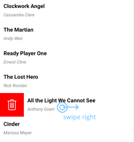
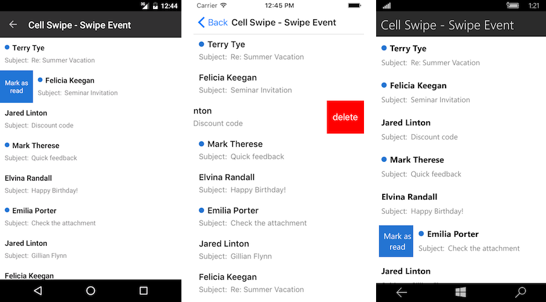
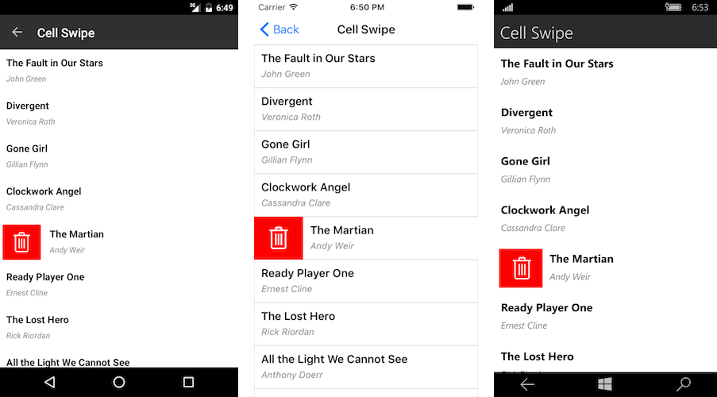

# Cell Swipe

Cell swipe allows end-users to use swipe gestures on cells. When users swipe, they reveal a designated custom view with buttons, images etc.

The image below shows how swiping right could reveal a Delete button on the left:

You can reveal another custom view if the user swipes left. In this case, Cell Swipe displays the custom view on the right. As soon as the user taps the swiped item or anywhere on the ListView, the item returns to its original position.

## Properties

You can use the following RadListView properties to configure the Cell Swipe feature:

- **IsItemSwipeEnabled** (*bool*): Enables or disables the Cell Swipe feature. The default value is False.
- **SwipeThreshold** (*double*): Defines the length (in pixels) of the swipe gesture that is required to trigger the feature. Shorter swipe gestures are not respected. The default value is 0.
- **SwipeOffset** (*Thickness*): Specifies how much to move the swiped cell to the side and stick it there. The default value is 100.
- **ItemSwipeContentTemplate** (*DataTemplate*): Defines the content that will be visualized when users swipe a cell.

>tip The **SwipeThreshold** value must be lower than the **SwipeOffset** value. This is required because the **SwipeThreshold** defines the minimum swipe gesture length that triggers the Cell Swipe feature and reveals a custom view.

## Methods

The following RadListView methods are related to the cell swiping feature:

- void **EndItemSwipe**(bool *isAnimated*): Moves the swiped item to its default position.

## Events

The following RadListView events are related to the cell swiping feature:

- **ItemSwipeStarting**: Occurs when the user initiates the swipe gesture. The event arguments are of the **ItemSwipeStartingEventArgs** type that provides the following properties:
  - **Item** (object): The item that will be swiped.
  - **Cancel** (bool): If you set this value to `false`, the swiping will be canceled.
- **ItemSwiping**: Occurs while the user is swiping the item. The event arguments are of the **ItemSwipingEventArgs** type that provides the following properties:
  - **Item** (object): The item that is being swiped.
  - **Offset** (double): The current swipe offset.
- **ItemSwipeCompleted**: Occurs when the user finishes the swipe gesture. The event arguments are of the **ItemSwipeCompletedEventArgs** type that provides the following properties:
  - **Item** (object): The item that has been swiped.
  - **Offset** (double): The swipe offset at which the item has been dropped.

## Commands

In addition to the swipe events, RadListView provides the following commands related to certain swipe actions:

- **ItemSwipeStarting**
- **ItemSwiping**
- **ItemSwipeCompleted**

For more details on how to utilize the ListView commands, see [Commands]().
  
## Examples

The RadListView swipe events allow you to configure custom actions that depend on the swipe direction, the swipe gesture length or the data item.

Alternatively, you can add interactive elements to the swipe content and use the swipe gesture only to reveal this content. The user can then choose how to interact with the revealed content.

### Example with swipe events

The following example demonstrates how to use the **ItemSwipeCompleted** event. Depending on the swipe gesture length, we will modify the data item or remove it from the source.

1. Add the view model for the ListView:

<snippet id='listview-gestures-cellswipe-swipeevents-viewmodel'/>

2. Set up ListView. Swiping left or right will reveal content with a hint for what will happen if the user completes the swipe action.

<snippet id='listview-gestures-cellswipe-swipeevents-listview'/>

3. Define the ListView namespace:

<snippet id='xmlns-teleriklistview'/>

4. Configure what happens when the user completes the swipe gesture:

<snippet id='listview-gestures-cellswipe-swipeevents-swipecompleted'/> 

We call the **EndItemSwipe()** method to force the item to go to its default position since the scenario does not require any interaction with the swipe content itself.

### Example with interactive content

The following example demonstrates how to add a delete button to the swipe content. We use the button's `Clicked` event handler to delete an item from the ListView source.

1. Add the view model for the ListView:

<snippet id='listview-gestures-cellswipe-interactivecontent-viewmodel'/>

2. Set up ListView. Note that the SwipeOffset is equal to the width of the button in the swipe content. Thus, when the swipe is complete, the revealed content will be the whole button.

<snippet id='listview-gestures-cellswipe-interactivecontent-listview'/>

3. Define the ListView namespace:

<snippet id='xmlns-teleriklistview'/>

4. Configure what happens when the user completes the swipe gesture. The BindingContext of the swipe content is the data item. This could be used to perform operations on the data. In this case, we will delete the item from the source.

<snippet id='listview-gestures-cellswipe-interactivecontent-deleteitem'/>

>important Sample Cell Swipe examples are available in the `ListView => Gestures` folder of the [SDK Browser application](#sdk-browser-application).
>
>You can directly explore the code in the [SDKBrowser Examples repository on GitHub](https://github.com/telerik/xamarin-forms-sdk/tree/master/XamarinSDK/SDKBrowser/SDKBrowser/Examples/ListViewControl/GesturesCategory).

## See Also

- [ListView Cell Types]()
- [ListView Layouts]()
- [Commands]()
- [Pull to Refresh]()
- [Reorder Items]()
