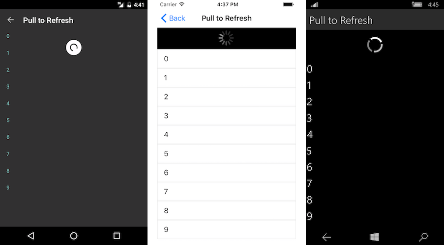

# Pull to Refresh

If the list contains items, which may change after the initial load, it may be good idea to allow users to refresh that list. **RadListView** is capable of doing this by a pull-to-refresh gesture. The feature allows the data to be refreshed by swiping finger down when the content is scrolled up to the top. This will trigger an animated activity indicator which will stay visible until data is refreshed.

This feature consists of:

- **RadListView.IsPullToRefreshEnabled**: a boolean property which gets or sets a statement disabling or enabling the feature. The default value of the property is false.
- **RadListView.RefreshRequested**: a public event which is triggered when the pull-to-refresh gesture is triggered. The custom data refreshing logic should be implemented in its handler.
- **RadListView.EndRefresh()**: a public method which must be called when the custom data refreshing logic finishes executing.

## Example

This example demonstrates how to enable the pull to refresh functionality.

Here is the definition of the list view in Xaml:

<snippet id='listview-gestures-pulltorefresh-listview'/>

Where:

<snippet id='xmlns-telerikdatacontrols'/>

Let's set some simple source to the list view in the code behind of the page:

<snippet id='listview-gestures-pulltorefresh-source'/>

And this is the method that updates the source of the list view when refresh is triggered:

<snippet id='listview-gestures-pulltorefresh-event'/>

This is how the refresh indicator looks like:

## See Also

- [ListView Cell Types]()
- [ListView Layouts]()
- [Cell Swipe]()
- [Reorder Items]()