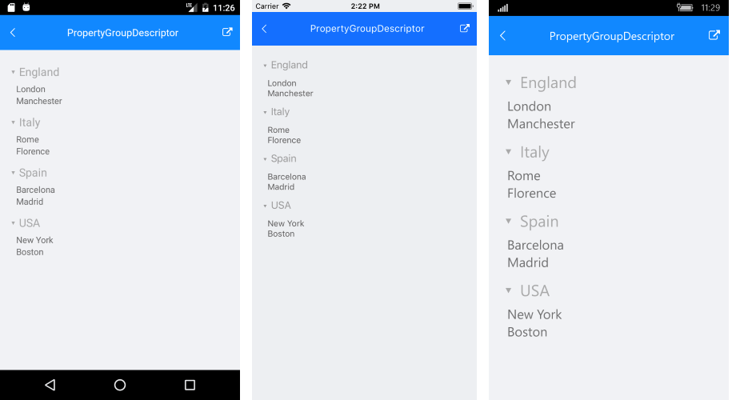
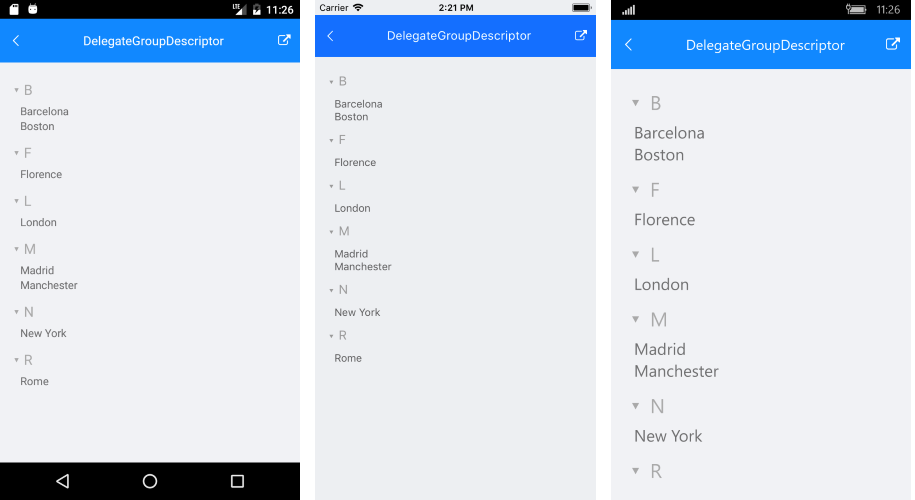
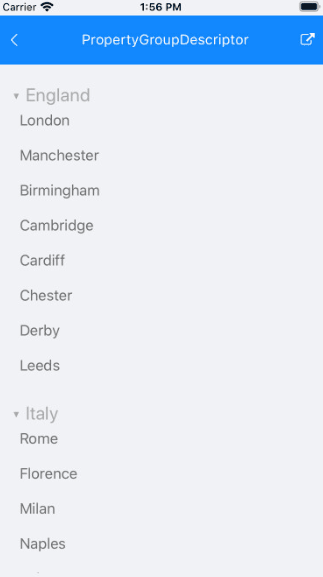
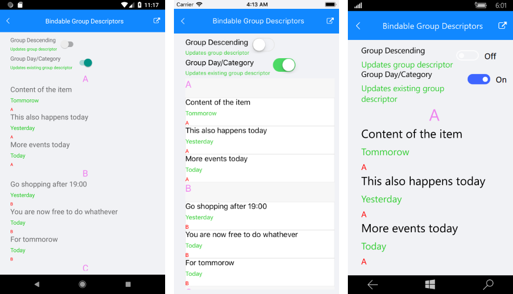

# Grouping

**RadListView** provides you with the functionality to programmatically group its data at runtime. This can be achieved through adding groupdescriptors to the **RadListView.GroupDescriptors** collection.

In addition, the control supports groups expand and collapse operations either through the UI by tapping on the group headers or programmatically. For more details on this refer to [Expand and Collapse Groups]().

## PropertyGroupDescriptor 

You can group the data by a property value from the class that defines your items. This descriptor exposes the following properties:

- **PropertyName**: Defines the string name of the property you want to group by.
- **SortOrder**: Defines the sort order in each group to Ascending or Descending.

Let's, for example, have the following business object:

<snippet id='listview-grouping-groupdescriptors-businessobject'/>

and a ViewModel with a collection of Cities:

<snippet id='listview-grouping-propertygroupdescriptor-viewmodel' />

Next snippet demonstrates how you could group the Cities by "Country" property through the PropertyGroupDescriptor:

<snippet id='listview-grouping-propertygroupdescriptor' />

### GroupHeaderTemplate

In addition, you could create custom **GroupHeaderTemplate** as well as **ListViewItemTemplate** in order to achieve the desired look when grouping the ListView. The BindingContext of the GroupHeader is a complex object and it includes the following properties:

- **IsExpanded**: Defines a value indicating whether the group is currently expanded (has its child items visible).
- **Items**: Gets the child items of the group.
- **Key**: Gets the specific for the group key.
- **Level**: Gets the zero-based level (or the depth) of the group.

The snippet below shows how the **GroupHeaderTemplate** is defined:

<snippet id='listview-grouping-templates' />

All that is left is to set the ViewModel as BindingContext of the control:

<snippet id='listview-grouping-propertygroupdescriptor-settingviewmodel' />

#### Figure 1: ListView grouped through PropertyGroupDescriptor


## DelegateGroupDescriptor 

This descriptor enables you to group by a custom key (e.g. some complex expression combining two or more properties) instead of being limited by the value of a single property. This descriptor exposes the following properties:

- **KeyExtractor**: Defines the `(Func<object, object)` delegate which returns the property to retrieve the group key for each data item.
- **SortOrder**:  Defines the sort order in each group to Ascending or Descending.

Let's use the same example from the previous section, just add DelegateGroupDescriptor through code instead. 

Next snippet shows how the ListView instance is defined:

<snippet id='listview-grouping-delegategroupdescriptor' />

And you could create and apply a delegate for grouping the items (for example by their first letter) as following:

<snippet id='listview-grouping-delegategroupdescriptor-settingdelegate' />

#### Figure 2: ListView grouped through DelegateGroupDescriptor


## Sticky Group Headers

Starting with R1 2020 SP release RadListView provides the option to set its group headers as sticky. This means the GroupHeader will "freeze" while scrolling through the items until the whole group is scrolled away. As you scroll through the next group, the currently sticked group header will be pushed by the next group header. 

To enable the sticky group headers behavior, just set **IsGroupHeaderSticky** property of the ListView to **True**. By default IsGroupHeaderSticky value is False.

```XAML
<telerikDataControls:RadListView x:Name="listView" 
                                  IsGroupHeaderSticky="True"  />
```
```C#
var listView = new RadListView();
listView.IsGroupHeaderSticky = true;
```

Check below the sticky group headers in action:



## Bindable GroupDescriptor

The GroupDescriptor collection now can be controlled by users using MVVM.

In order to control the GroupDescriptor collection through MVVM: 

1. Create a property of type ObservableCollection<GroupDescriptorBase> in your ViewModel which will contain the needed group descriptors:
 
 <snippet id='listview-features-bindable-groupdescriptor-viewmodel' />
 
2. Use **OneWayToSource** binding mode to bind that property to the GroupDescriptors property of RadListView:

<snippet id='listview-features-bindable-groupdescriptor-xaml' />

Here is how the GroupDescriptor collection looks like through MVVM:



>important You can find a working demo labeled **Bindable Group Descriptors** in the ListView/Bindable Collections folder of the [SDK Samples Browser application](). 

## See Also

- [Filtering]()
- [Sorting]()
- [Selection]()
