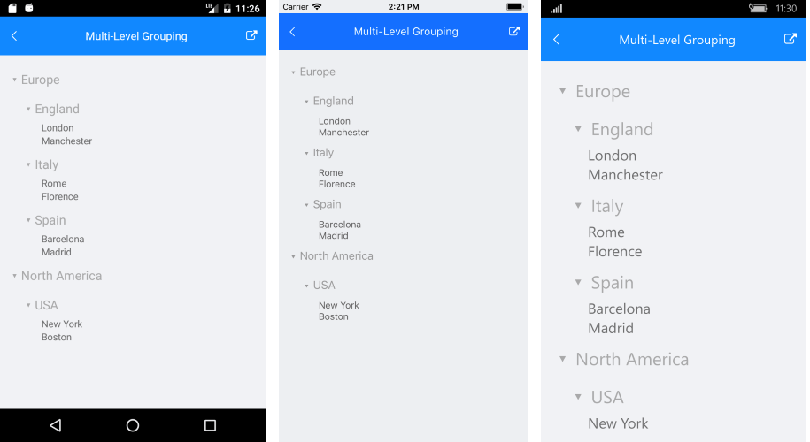

# Multi-Level Grouping

This article provides an overview on how you could enable multi-level grouping in RadListView. 

>note Before proceeding please go through [Grouping Overview]() topic.

First, let's create the following business object:

<snippet id='listview-grouping-multilevel-businessobject' />

The next example demonstrates how RadListView could be bound to a collection of *City* objects and grouped hieararchically by *Continent* and *Country*.

To accomplish the task, create a ViewModel class as shown below:

<snippet id='listview-grouping-multilevel-viewmodel' />

Then, in order to visualize the hierarchical relation between groups, add a custom **GroupHeaderTemplate** (of type *DataTemplate*) to the Resources of your page:

<snippet id='listview-grouping-multilevel-templates' />

where LevelToMarginConverter just calculates the margin of each group header according to its Level:

<snippet id='listview-grouping-multilevel-templates' />

Lastly, add the RadListView definition with two **PropertyGroupDescriptors** as shown in the next snippet:

<snippet id='listview-grouping-multilevel-definition' />

Here is the final result:

## See Also

- [Grouping]()
- [Filtering]()
- [Sorting]()