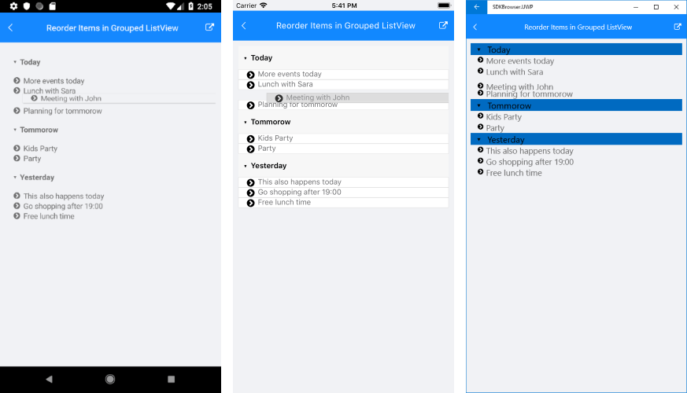

# Reorder Items in Grouped ListView

This help topic will provide an overview on how you could enable reordering feature of RadListView control when its items are grouped.

>tip Before proceeding, please check the [Reorder Items]() topic which describes in details reordering functionality of the ListView.

When the items of RadListView are grouped by a certain criteria and the end user drags/starts reordering an item, the dragged item could be added to a different group. Since this depends on the items' relation, in order to handle the scenario, you would need to subscribe to the ListView Reorder Command and manually update the dragged item details. Below you could find a sample implementation.

First, let's create a sample business object, for example *Event*:

<snippet id='listview-grouping-reorderitems-businessobject' />

Then, create a ViewModel class containing a collection of *Event* objects as well as a Reorder command implementation considering the Events will be grouped according to *Day* property. Inside the Reorder command you will have access to some useful details through *ReorderEndedCommandContext* such as:

* Item: Refers to the data item that is being interacted with.
* DestinationItem: Refers to the data item that corresponds to the location where the dragged item has been released.
* Group: Gets the group containing the data item that is being interacted with.
* DestinationGroup: Refers to the group that corresponds to the location where the dragged item has been released.
* Placement (of type *ItemReorderPlacement*):  Indicates whether the dragged item should be placed before or after the destination item.

<snippet id='listview-grouping-reorderitems-viewmodel' />

And here is the RadListView definition with PropertyGroupDescriptor and Reorder command applied:

<snippet id='listview-grouping-reorderitems-xaml' />

Lastly, set the ViewModel as a BindingContext:

<snippet id='listview-grouping-reorderitems-setviewmodel' />

You could check the result on the image below:

## See Also

- [Grouping]()
- [Commands]()
