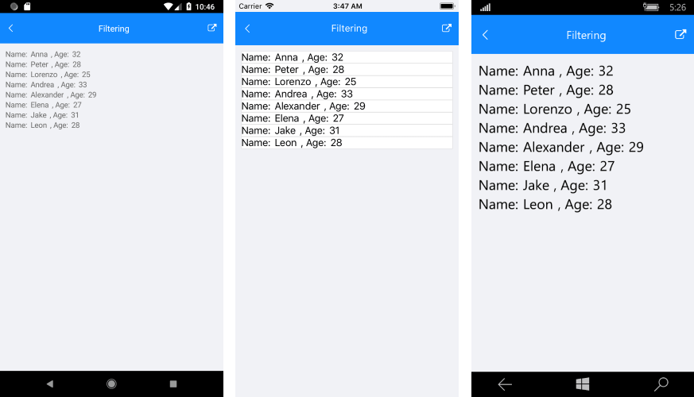
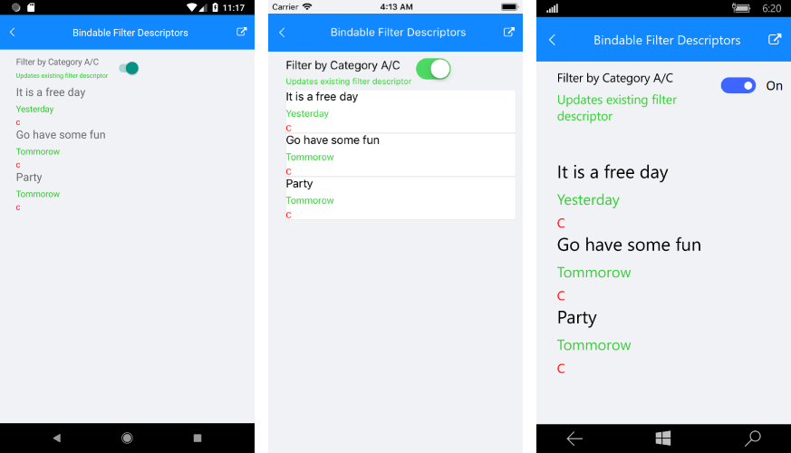

# Filtering

**RadListView** provides you with the functionality to programmatically filter its data at runtime. This can be achieved through adding filter descriptors that implement the IFilter interface to the **RadListView.FilterDescriptors** collection. You can use our **DelegateFilterDescriptor** implementation.

## DelegateFilterDescriptor 

- **Filter**: Defines the function used to check whether a data item passes the filter or not.

## Example

First, define the ListView in XAML:

<snippet id='listview-features-filtering-xaml'/>

Add the following code to the Filtering class:

<snippet id='listview-features-filtering-agefilter'/>

Here is the ViewModel class:

<snippet id='listview-features-filtering-viewmodel'/>
    
And here is the data class:

<snippet id='listview-features-filtering-data-class'/>	

Here is the result after the data is filtered:

>important A sample example how to create ListView with FilterDescriptor can be found in the ListView/Features folder of the [SDK Samples Browser application]().

## Bindable FilterDescriptor

The RadListView control supports binding. What's new is that now the users can control the FilerDescriptor collection through MVVM.

In order to control the FilterDescriptor collection through MVVM: 

1. Create a property of type ObservableCollection<FilterDescriptorBase> in your ViewModel which will contain the needed filters. Here is a sample ViewModel:
    
<snippet id='listview-features-bindable-filterdescriptor-viewmodel' /> 

2. A sample business model:

<snippet id='listview-features-bindable-filterdescriptor-business-model' />
    
3. Use **OneWayToSource** binding mode to bind that property to the FilterDescriptors property of RadListView:

<snippet id='listview-features-bindable-filterdescriptor-xaml' />

Here is how this looks like:

>important Bindable Filter Descriptor example can be checked in our [SDK Samples Browser application]() ListView/BindableCollections folder. 

## See Also

- [Grouping]()
- [Sorting]()
- [Selection]()
