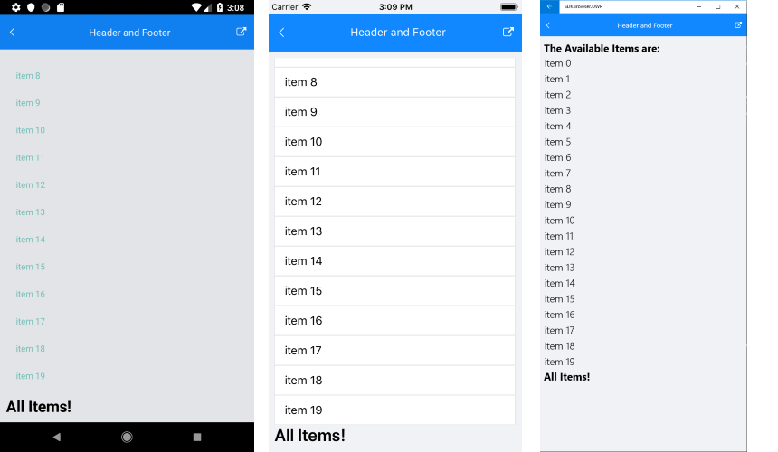

# Header and Footer

With R1 2019 release of Telerik UI for Xamarin RadListView exposes two new templates - **Header** and **Footer**, which will allow you to add content of your choice above and below the list with the items. Both header and footer templates are scrolled along with the ListView items. 

* **HeaderTemplate**(DataTemplate): Defines the Header of the ListView before all items.
* **FooterTemplate**(DataTemplate): Defines the Footer of the ListView after all items.

## Example

Here is an example how to add Header and Footer to the RadListView control.

First, create a ViewModel:

<snippet id='listview-features-header-and-footer-viewmodel'/>

Use the following snippet to declare the RadListView in XAML:

<snippet id='listview-features-header-and-footer-xaml'/>

Set the HeaderTemplate as a static resource of type *HeaderTemplate*:

<snippet id='listview-features-header-template-xaml'/>

Set the FooterTemplate as a static resource of type *FooterTemplate*:

<snippet id='listview-features-footer-template-xaml'/>

ListView Header:

ListView Footer:

>important A sample Header and Footer example can be found in the ListView/Features folder of the [SDK Samples Browser application]().

## See Also

- [Events]()
- [Selection]()
- [Reordering]()
