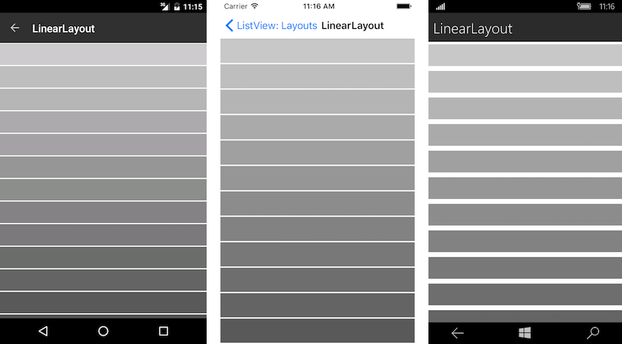
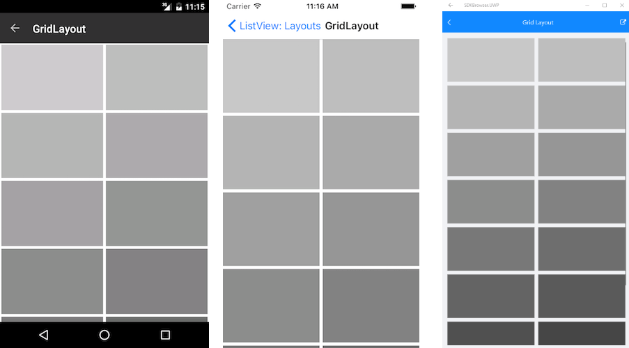

# Layouts

The **RadListView** control supports two layouts: linear and grid through the **LayoutDefinition** property. It accepts values of type ListViewLayoutBase which is a base class for all list view layouts. 

Here are the properties exposed by the ListViewLayoutBase class: 

- **VerticalItemSpacing** (double): Gets or sets the vertical space between two items.
- **HorizontalItemSpacing** (double): Gets or sets the horizontal space between two items.
- **ItemLength** (double): Gets or sets the width or height (depending on the layout orientation) of the items. The default value is -1 which means that the items will be sized according to the targeted platform default behavior.
- **GroupHeaderLength** (double): Gets or sets the width or height (depending on the layout orientation) of the group headers. The default value is -1 which means that the items will be sized according to the targeted platform default behavior.
- **Orientation** (Orientation): Gets or sets the orientation (scroll direction) of the layout.

## Linear Layout

Linear layout is the default layout of the control. It can be explicitly set by creating an instance of the **ListViewLinearLayout** class and assigning it to the **RadListView.LayoutDefinition** property.

### Example

This example will demonstrate how to use the **RadListViewLinearLayout**.

Here is the list view definition in Xaml:

<snippet id='listview-layouts-linearlayout-listview'/>

Where:

<snippet id='xmlns-teleriklistview'/>

The ItemsSource of the control can be set in the code behind of the page:

<snippet id='listview-layouts-linearlayout-source'/>

This is the result:

## Grid Layout

The Grid Layout allows distributing cells in a fixed number of columns/rows. It exposes the following properties in addition to the basic layout properties:

- **SpanCount** (int): Gets or sets the count of the columns / rows (depending on the orientation) of the list. 

The grid layout can be utilized by setting the **RadListView.LayoutDefinition** property to a new instance of the **ListViewGridLayout** class.

### Example

This example will demonstrate how to use the **RadListViewGridLayout**.

Here is the list view definition in Xaml:

<snippet id='listview-layouts-gridlayout-listview'/>

Where:

<snippet id='xmlns-teleriklistview'/>

The ItemsSource of the control can be set in the code behind of the page:

<snippet id='listview-layouts-gridlayout-source'/>

This is the result:

## See Also

- [ListView Cell Types]()
- [Cell Swipe]()
- [Pull to Refresh]()
- [Reorder Items]()