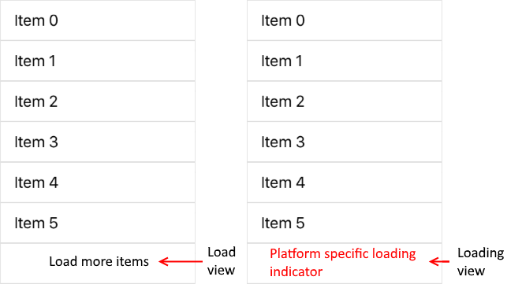

# Load On Demand

Loading a large data set on a mobile device has its challenges. One of the most popular approaches is using incremental data loading as the items needs to be visualized. **RadListView** is capable of doing this using its load on demand functionality. The following properties are related to the **LoadOnDemand** feature:

* **IsLoadOnDemandEnabled**(*bool*) - used to enable the load on demand mechanism of RadListView;
* **IsLoadOnDemandActive** (*bool*) can be used once *IsLoadOnDemandEnabled* property is set to *true*. When the data is loading the *IsLoadOnDemandActive = "true"*, otherwhise *IsLoadOnDemandActive = false*.

RadListView offers two loading modes through its **LoadOnDemandMode** property:
 * **Automatic** - the data is requested automatically when you scroll near the end of the RadListView's items.
 * **Manual** - a button is rendered at the end of the RadListView. The data is requested explicitly by pressing the button.

In order to load the data RadListView requires either to:
 * Subscribe to **LoadOnDemand** event and add the loaded data to the source.
 * Create **ListViewLoadOnDemandCollection** instance as source and pass it to RadListView ItemsSource property.

## Automatic mode
You could load the data automatically using event. In this case here is how the setup will look like:

### Define the RadListView in XAML

Let's have the following RadListView definition, notice the **LoadOnDemand** event:

<snippet id='listview-loadondemand-loadondemandeventauto-declaration'/>

You would also need to define the `telerikDataControls` XML namespace:

<snippet id='xmlns-telerikdatacontrols'/>

### Add the code to load the data in the LoadOnDemand event

First, set RadListView **ItemsSource** property in page's constructor:

<snippet id='listview-loadondemand-loadondemandeventauto-bind'/>

Finally, add the `ListView_LoadOnDemand` event handler and the rest of the code:

<snippet id='listview-loadondemand-loadondemandeventauto-event'/>

## Manual loading mode

Alternatively, you can explicitly request items only when pressing the "load more" button rendered at the end of the currently loaded items.

### Define the RadListView in XAML with manual loading mode

Use the following RadListView definition:

<snippet id='listview-loadondemand-loadondemandeventmanual-declaration'/>

You would also need to define the `telerikDataControls` XML namespace:

<snippet id='xmlns-telerikdatacontrols'/>

### Add the code to load the data in the LoadOnDemand event

First, set RadListView **ItemsSource** property in page's constructor:

<snippet id='listview-loadondemand-loadondemandeventmanual-bind'/>

Then, add the following event handler:

<snippet id='listview-loadondemand-loadondemandeventmanual-event'/>

Figure 1: Manual Loading on demand

## Loading mode with collection
In many scenarios you would like to control the loading of the data directly from the view model. For these cases you can take advantage of our **ListViewLoadOnDemandCollection** that takes case of requesting new items internally. It can work both in **Manual** and **Automatic** mode. Let's see the setup for Automatic loading mode using the collection.

### Define the RadListView in XAML

Define the RadListView in XAML and bind the **ItemsSource** property to the data in the view model:

<snippet id='listview-loadondemand-loadondemandcollection-declaration'/>

You would also need to define the `telerikDataControls` XML namespace:

 <snippet id='xmlns-telerikdatacontrols'/>

### Define the View Model Class

Use the following snippet to define the view model class:

<snippet id='listview-loadondemand-loadondemandcollection-viewmodel'/>

> **Important** If you deviate from the above example and instantiate the `Source` property outside of the constructor, you will need make sure that the view model implements INotifyPropertyChanged and the `Source` property setter invokes OnPropertyChanged. Otherwise, you will not see any changes in the UI.

### Bind the BindingContext 

Finally, set the page's **BindingContext** to an instance of `ListViewModel` in the page's constructor:

<snippet id='listview-loadondemand-loadondemandcollection-binding'/>

## Advanced options

### Control the Number of Pre-loaded Items

This feature works in conjunction with [LoadOnDemandMode.Automatic mode of the listview](#automatic-mode).  You can control the number of minimum items loaded ahead through RadListView's  **LoadOnDemandBufferItemsCount** property. When the RadListView requests an item in the buffer range it will trigger new loading batch. 

Example: If you set the buffer to 20 items, when the user scrolls down to an item that is 20 items or less from the bottom, load on demand will be triggered.

> The default value of LoadOnDemandBufferItemsCount is **10**.

### Change the Appearance of Manual Load Button

This feature works in conjunction with [LoadOnDemandMode.Manual mode of the listview](#manual-loading-mode)
You can control load more button content through the **LoadOnDemandItemTemplate** property.

<snippet id='listview-loadondemand-loadondemandcustomizations-lodbutton'/>

### Change the Appearance of Manual Loading Indicator

This feature works in conjunction with [LoadOnDemandMode.Manual mode of the listview](#manual-loading-mode)
You can control the loading indicator content through the **LoadingOnDemandItemTemplate** property.

<snippet id='listview-loadondemand-loadondemandcustomizations-loadingindicator'/>

## See Also

- [Events]()
- [Selection]()
- [Reordering]()
