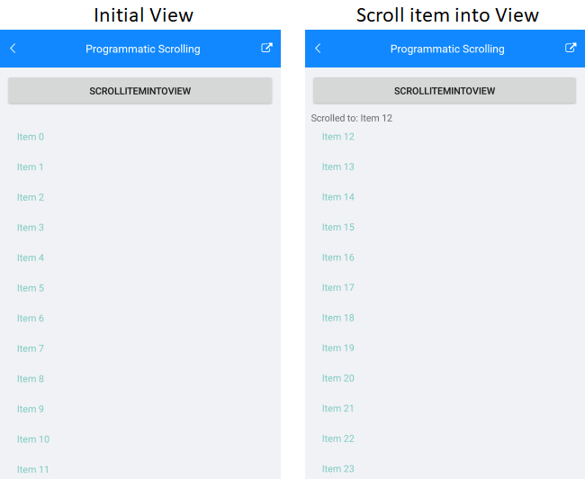

# Scrolling

## Vertical ScrollBar

With R1 2020 SP release RadListView provides the option to set the visibility of its vertical scrollbar according to your preferences:

* **VerticalScrollBarVisibility**(*Xamarin.Forms.ScrollBarVisibility*): Specifies whether the vertical scrollbar will be visualized. By default it is set to ScrollBarVisibility.Default which means the scrollbar behavior depends on the target platform.

Here is a quick snippet on how you can set it to ScrollBarVisibility.Always:

```XAML
<telerikDataControls:RadListView x:Name="listView" 
                                 VerticalScrollBarVisibility="Always" />
```
```C#
var listView = new RadListView();
listView.VerticalScrollBarVisibility = ScrollBarVisibility.Always;
```

## Programmatic Scrolling

RadListView exposes the following method for programmatic scrolling to a specific data item: 

* **ScrollItemIntoView(object item)**: Attempts to bring the specified data item into the view.

## Example

Here is the definition of the ListView control:

<snippet id='listview-features-programmatic-scrolling-xaml'/>

use the following code to create a simple data for the ListView component:

<snippet id='listview-features-programmatic-scrolling'/>

Create a method called **ScrollToItem** and inside this method use __ScrollItemIntoView__ to navigate to a concrete item:

<snippet id='listview-features-programmatic-scrolling-scroll-to-item-method'/>
	
And the end result:

#### Figure 1: Scrolling item into View

	
## See Also

- [Selection]()
- [Grouping]()
- [Reordering]()


