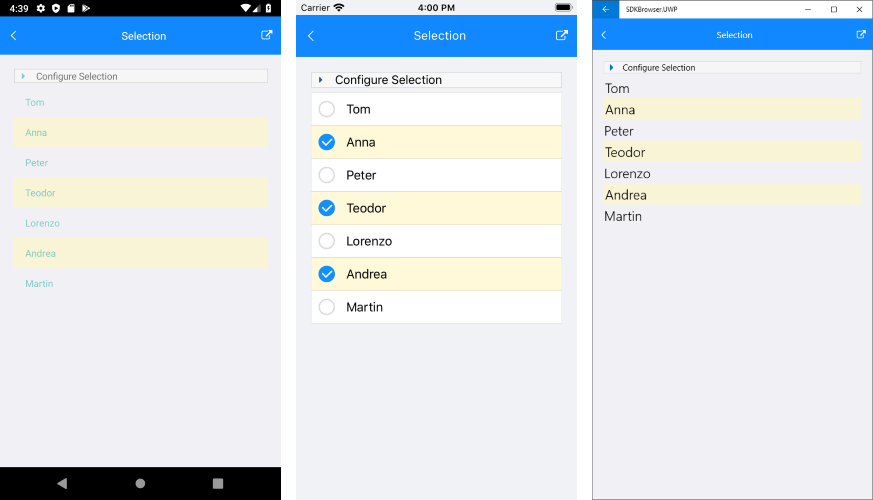

# Selection

**RadListView** component exposes selection feature. It allows users to select one or many items out of the ItemsSource of the control. This feature provides both visual and programmatic feedback for the actions of the user. 

This article will show the basic properties RadListView provides for working with selection.

## Selection Configuration

RadListView provides three selection modes, which allow you to manipulate the type of selection. This is controlled by the **SelectionMode** property which has the following entries:

- **SelectionMode** (*Telerik.XamarinForms.DataControls.ListView.SelectionMode*): 
	- None - This mode doesn't allow users to select an item. 
	- Single - This is the default selection mode. It allows users to select only one item.
	- Multiple - This mode allows users to select more than one item. 

Check below how you can set **SelectionMode** in XAML and code-behind:

```XAML
<telerikDataControls:RadListView x:Name="listView"
                                 SelectionMode="Multiple" />
```
```C#
var listView = new RadListView();
listView.SelectionMode = Telerik.XamarinForms.DataControls.ListView.SelectionMode.Multiple;
```
			
You can also configure how the selection to be triggered by the end users through the **SelectionGesture** property:

- **SelectionGesture** (*Telerik.XamarinForms.DataControls.ListView.SelectionGesture*):
	- Tap - Users need to tap on an item to select it. This is the default SelectionGesture value;
	- Hold - Users need to tap & hold on an item to select it.

```XAML	
<telerikDataControls:RadListView x:Name="listView"
                                 SelectionGesture="Hold" />
```
```C#
var listView = new RadListView();
listView.SelectionGesture = Telerik.XamarinForms.DataControls.ListView.SelectionGesture.Hold;
```

## Getting Selected Items

RadListView exposes the following properties for getting the selected item or items in case of multiple selection:

- **SelectedItems** (*ObservableCollection&lt;object&gt;*): Read-only collection used to get the currently selected items;
- **SelectedItem** (*object*): Specifies the last selected item of the ListView.

## Selection Events
	
- **SelectionChanged**: An event that is triggered whenever the SelectedItems collection is changed. The __SelectionChanged__ event handler receives two parameters:
	* The sender argument which is of type object, but can be cast to the __RadListView__ type.
	* A __NotifyCollectionChangedEventArgs__ object which provides information on the collection changed event. For more details check [NotifyCollectionChangedEventArgs Class](https://docs.microsoft.com/en-us/dotnet/api/system.collections.specialized.notifycollectionchangedeventargs) topic.

## Styling

You can customize the way selected items look by applying **SelectedItemStyle** property to the RadListView instance. For detailed information on the approach go to [Items Styles]() topic in ListView documentation.

## Example

The example below shows how to utilize RadListView selection feature - how you can set multiple selection, apply selected item style and retrieve the selected items in a ViewModel class.

First, create a ViewModel class with two collections - one for the ItemsSource of the ListView and one that will hold the SelectedItems. For the purpose of the example RadListView is bound to a collection of strings:

<snippet id='listview-features-selection-viewmodel'/>

Next, add RadListView instance to your page with selection properties applied:

<snippet id='listview-features-selection-xaml'/>

Lastly, set the ViewModel class as a BindingContext:

<snippet id='listview-features-selection-setvm' />

Here is how the **RadListView** control looks like on different platforms when multiple items are selected:



>important A sample Selection example is available in ListView -> Features folder of the [SDK Browser application](#sdk-browser-application).
>
>You can directly explore the code in the [SDKBrowser Examples repository on GitHub](https://github.com/telerik/xamarin-forms-sdk/tree/master/XamarinSDK/SDKBrowser/SDKBrowser/Examples/ListViewControl/FeaturesCategory/SelectionExample).


## See Also
- [Items Grouping]()
- [Items Sorting]()
- [Items Styling]()
