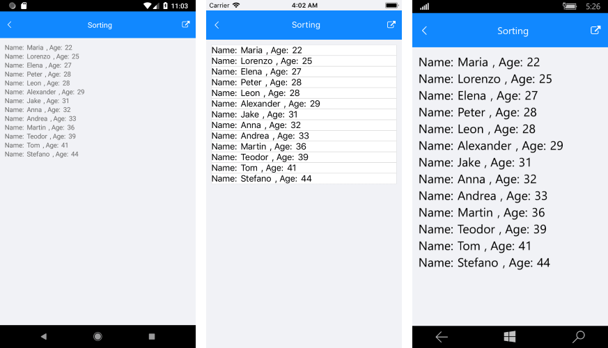
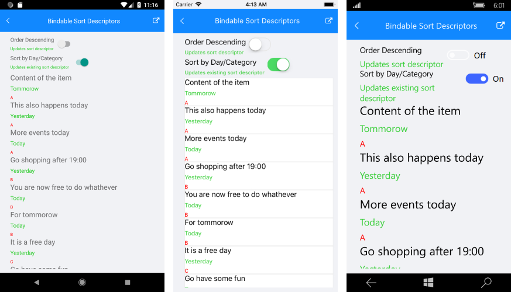

# Sorting

**RadListView** can be used to sort the visualized data. This can be achieved by adding different SortDescriptors to its **SortDescriptors** collection. There are two types of descriptors shipped with our code.

## PropertySortDescriptor 

You can sort the data by a property value from the class that defines your business items. This descriptor exposes the following properties:

- **PropertyName**: Defines the string name of the property that is used to retrieve the key to sort by.
- **SortOrder**: Specifies sort order to Ascending or Descending.

## DelegateSortDescriptor 

This descriptor enables you to sort by a custom key (e.g. some complex expression combining two or more properties) instead of being limited by the value of a single property. This descriptor exposes the following properties:

- **SortOrder**: Sets the sort order to Ascending or Descending.
- **Comparer**: Defines the Compare method used by the internal [IComparer](https://docs.microsoft.com/en-us/dotnet/api/system.collections.icomparer).

## Example

Here is an example that will guide you how to use SortDescriptor in ListView.

First, define the ListView in XAML:

<snippet id='listview-features-sorting-xaml'/>

Add the following code to the Sorting class:

<snippet id='listview-features-sorting-agesort'/>

Use the following snippet for the ViewModel class: 

<snippet id='listview-features-sorting-viewmodel'/>

Create a class Person and add the code below:

<snippet id='listview-features-sorting-data-class'/>

Here is the result once the data is sorted.

>important A sample example how to create ListView with SortDescriptor can be found in the ListView/Features folder of the [SDK Samples Browser application]().

## Bindable SortDescriptor

Currently the SortDescriptor of the RadListView supports binding. What's new is that now the users can control it using MVVM.

In order to control the descriptors collections through MVVM: 

* Create a property of type ObservableCollection<SortDescriptorBase> in your ViewModel which will contain the needed sort descriptors:

<snippet id='listview-features-bindable-sortdescriptor-viewmodel' />

* Use **OneWayToSource** binding mode to bind that property to the SortDescriptors property of RadListView:

<snippet id='listview-features-bindable-sortdescriptor-xaml' />

Here is the result:

>important An example how to create a ListView with SortDescriptor collection that can be controlled through MVVM can be found in the ListView/Bindable Collections folder of the [SDK Samples Browser application]().

## See Also

- [Grouping]()
- [Filtering]()
- [Selection]()
