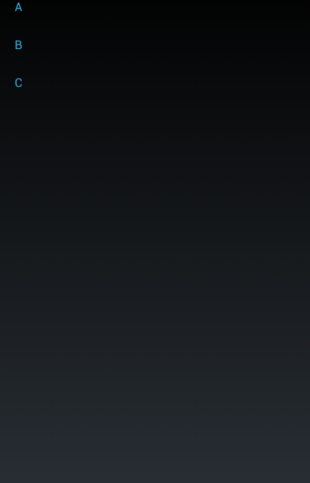
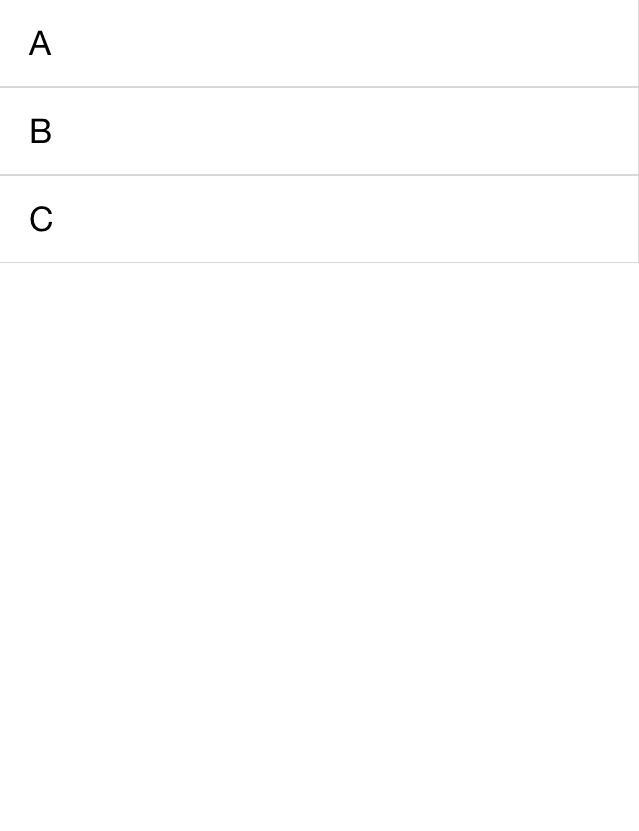

# Getting Started #

This example will guide you through the steps needed to add a basic RadListView control in your application.

## Update existing Xamarin.Forms package
After creating the blank mobile application template is recommended to update all existing NuGet packages in your solution. The essential ones are the **Xamarin.Forms** and the **Xamarin Support Library v4** packages. Updating them to the latest version can be done using the NuGet UI.

## Add References to Telerik UI for Xamarin.Forms ##
Next you have to add reference to the following assemblies:

* **Portable** (if you have created Xamarin.Forms Portable App)

	- Telerik.XamarinForms.DataControls.dll
	- Telerik.XamarinForms.Common.dll

* **Android**

	- Telerik.Xamarin.Android.Common.dll
	- Telerik.Xamarin.Android.Data.dll
	- Telerik.Xamarin.Android.Input.dll
	- Telerik.Xamarin.Android.List.dll
	- Telerik.XamarinForms.Common.dll
	- Telerik.XamarinForms.DataControls.dll
	- Telerik.XamarinForms.DataControlsRenderer.Android.dll

* **iOS**

	- Telerik.Xamarin.iOS.dll
	- Telerik.XamarinForms.Common.dll
	- Telerik.XamarinForms.DataControls.dll
	- Telerik.XamarinForms.DataControlsRenderer.iOS.dll

* **WinPhone**
	
>Not available

You will also have to add the following code to these project files:

* **Android**: MainActivity.cs
  
		[assembly: Xamarin.Forms.ExportRenderer(typeof(Telerik.XamarinForms.DataControls.RadListView), typeof(Telerik.XamarinForms.DataControlsRenderer.Android.ListViewRenderer))]

* **iOS**: AppDelegate.cs

		[assembly: Xamarin.Forms.ExportRenderer(typeof(Telerik.XamarinForms.DataControls.RadListView), typeof(Telerik.XamarinForms.DataControlsRenderer.iOS.ListViewRenderer))]
	You also have to create the following instances in the FinishedLaunching() method:

		new Telerik.XamarinForms.DataControlsRenderer.iOS.ListViewRenderer();

* **WinPhone**: MainPage.xaml.cs
    
>Not available

## Edit the iOS project
After referencing the required binaries it is time to edit the default configuration of the iOS project. Unload it and open the iOS.csproj file. Inside it you will find several PropertyGroups. One for each build definition. Inside each group you will find CodesignEntitlements tag. Those tags should be empty in each build definition. More information on that matter can be found in [this]({http://forums.xamarin.com/discussion/39674/iphonesimulator-build-results-in-no-valid-ios-code-signing-keys-found-in-keychain}) forum thread.

## NuGet Packages
Next step is to reference the correct NuGet Packages for the Android project. The required packages are not the latest version available this is why you need to use the PackageManagerConsole to install specific version. The required packages are:
* **Xamarin.Android.Support.v7.AppCompat** version: **21.0.3.0**
* **Xamarin.Android.Support.v7.RecyclerView** version: **21.0.3.0**

You can use the commands described below to install the required version:

	Install-Package Xamarin.Android.Support.v7.AppCompat -Version 21.0.3.0
and

	Install-Package Xamarin.Android.Support.v7.RecyclerView -Version 21.0.3.0
	
After successful installation of those packages the application should be set up and ready to build and deploy.

## Example

Users can visualize the **RadListView** using XAML code like this:

	<telerik:RadListView x:Name="LV"/> 

where the **telerik** namespace is defined like this:

	xmlns:telerik="clr-namespace:Telerik.XamarinForms.DataControls;assembly=Telerik.XamarinForms.DataControls"
The next step is to add the items that will be visualized. This can be done in code like this:

	InitializeComponent();
	this.LV.ItemsSource = new List<string>() { "A", "B", "C" };
An alternative way to visualize the component is to create it entirely in code. This can be done like this:

	var listView = new RadListView();
	listView.ItemsSource = new List<string>() { "A", "B", "C" };
	this.Content = listView;
The result will be similar to the following pictures.

Figure 1: RadListView in Android

Figure 2: RadListView in iOS

