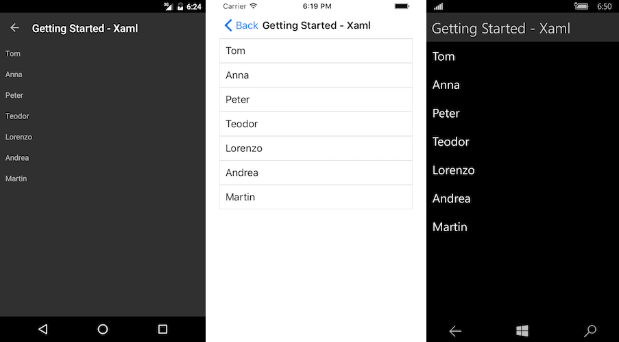

# Getting Started

This article will guide you through the steps needed to add a basic **RadListView** control in your application.

* [Setting up the app](#1-setting-up-the-app)
* [Adding the required Telerik references](#2-adding-the-required-telerik-references)
* [Adding RadListView control](#3-adding-radlistview-control)
* [Populating RadListView with data](#4-populating-radlistview-with-data)

## 1. Setting up the app

Take a look at these articles and follow the instructions to setup your app:

- [Setup app with Telerik UI for Xamarin on Windows]()
- [Setup app with Telerik UI for Xamarin on Mac]()

## 2. Adding the required Telerik references

You have two options:

* Add the Telerik UI for Xamarin Nuget package following the instructions in [Telerik NuGet package server]() topic.

If you don't want to add the all Telerik.UI.for.Xamarin nuget package, you have the option to add a separate nuget package. For RadListView control you have to install the **Telerik.UI.for.Xamarin.DataControls** nuget package. This nuget will automatically refer the Telerik.UI.for.Xamarin.Primitives and Telerik.UI.for.Xamarin.Common nuget packages.

* Add the references to Telerik assemblies manually, check the list below with the required assemblies for **RadListView** component:

| Platform | Assemblies |
| -------- | ---------- |
| Portable | Telerik.XamarinForms.Common.dll <br/> Telerik.XamarinForms.DataControls.dll <br /> Telerik.XamarinForms.Primitives.dll <br /> Telerik.XamarinForms.SkiSharp.dll |
| Android  | Telerik.Xamarin.Android.Common.dll <br/> Telerik.Xamarin.Android.Data.dll <br/> Telerik.Xamarin.Android.Input.dll <br/> Telerik.Xamarin.Android.List.dll <br/> Telerik.Xamarin.Android.Primitives.dll <br/> Telerik.XamarinForms.Common.dll <br/> Telerik.XamarinForms.DataControls.dll <br /> Telerik.XamarinForms.Primitives.dll <br /> Telerik.XamarinForms.SkiSharp.dll|
| iOS      | Telerik.Xamarin.iOS.dll  <br/> Telerik.XamarinForms.Common.dll <br/> Telerik.XamarinForms.DataControls.dll <br /> Telerik.XamarinForms.Primitives.dll <br /> Telerik.XamarinForms.SkiSharp.dll |
| UWP      | Telerik.Core.dll <br/> Telerik.Data.dll <br/> Telerik.UI.Xaml.Controls.Data.UWP.dll <br/> Telerik.UI.Xaml.Input.UWP.dll <br/> Telerik.UI.Xaml.Primitives.UWP.dll <br/> Telerik.XamarinForms.Common.dll <br/> Telerik.XamarinForms.DataControls.dll <br /> Telerik.XamarinForms.Primitives.dll <br /> Telerik.XamarinForms.SkiSharp.dll |

## 3. Adding RadListView control

You could use one of the following approaches:

#### Drag the control from the Toolbox. 

Take a look at the following topics on how to use the toolbox:

* [Telerik UI for Xamarin Toolbox on Windows]()
* [Telerik UI for Xamarin Toolbox on Mac]()
	
#### Create the control definition in XAML or C# .

The snippet below shows a simple RadListView definition (_Do not use a `StackLayout` or `ScrollView` parent, see the **WARNING** note below_):

```XAML
<telerikDataControls:RadListView x:Name="listView" />
```
```C#
var listView = new RadListView();
```

In addition to this, you need to add the following namespace:

<snippet id='xmlns-telerikdatacontrols' />
<snippet id='ns-telerikdatacontrols' />

> **WARNING**: RadListView control provides UI virtualization, this feature requires the visual parent to provide vertical or horizontal space. To avoid breaking UI virtualization or gesture mechanisms, please follow these rules: 
>	* **Do not** place the RadListView control inside a `StackLayout`
>	* **Do not** place the RadListVew inside a `ScrollView`
>	* **Do not** set the RadListVew to a Grid `RowDefinition Height="Auto"`
>
> For additional information and solutions for these layouts, please check the [Controls are not Apppearing]() article.

## 4. Populating RadListView with data

First, lets create a simple data and view model classes:

<snippet id='listview-gettingstarted-source'/>

Here is the setup of the ListView:

<snippet id='listview-gettingstarted-listview-xaml'/>
<snippet id='listview-gettingstarted-listview-csharp'/>

You have to add the following namespaces:

<snippet id='xmlns-teleriklistview'/>
<snippet id='ns-teleriklistview'/>

This is the result:



>important **SDK Browser** and **QSF** applications contain different examples that show RadListView's main features. You can find the applications in the **Examples** and **QSF** folders of your local **Telerik UI for Xamarin** installation.

## See Also

- [Cell Types]()
- [Selection]()
- [Grouping]()
