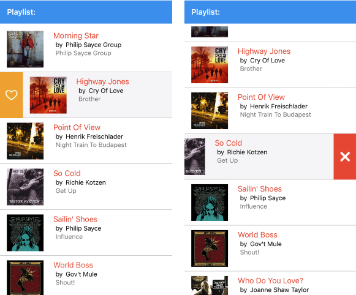

# Overview

**RadListView** is a virtualizing list component that provides the most popular features associated with scenarios where a list of items is used. All these features are embedded in one control with the idea to save developer's time and provide better experience. 

#### Figure 1: RadListView Overview

## Key features

* **Selection**: RadListView supports both single and multiple selection, additionally items can be selected on tap or on hold gestures. For more details check [Selection]() article.
* **Different layouts and orientation**: You could choose between linear and grid layout as well as define the scroll direction of the layout. Read more about this in the [Layouts]() topic.
* **ItemTemplateSelector**: RadListView control exposes an ItemTemplateSelector property which you can use to apply different template to each item depending on a specific condition.  Read more about it in the [ItemTemplateSelector]() topic.
* **Reorder Items**: Allows end-users to reorder ListView items using drag and drop. Read more about it in the [Reorder Items]() topic.
* **Load on demand**: In addition to the built-in UI virtualization, the control supports load-on-demand. This optimizes the initial loading of the app and the new items are loaded before the user reaches the bottom of the ListView. Read more about this functionality in the [Load on Demand]() article.
* **Item Swipe**: The item swipe feature enables end-users to swipe an item to reveal actionable content beneath. For more details check [Cell Swipe]() topic.
* **Grouping, sorting and filtering**: You could easily visualize your items in groups, sorted and filtered in accordance with your criteria. For detailed instructions on how to enable these features, check [Grouping](), [Sorting]() and [Filtering]() topics.
* **Customizable Items**: Take advantage of the styling capabilities of RadListView by using its Style properties such as ItemStyle, SelectedItemStyle, etc. For more details check [Styling]() article. 

## See Also

- [Getting Started]()