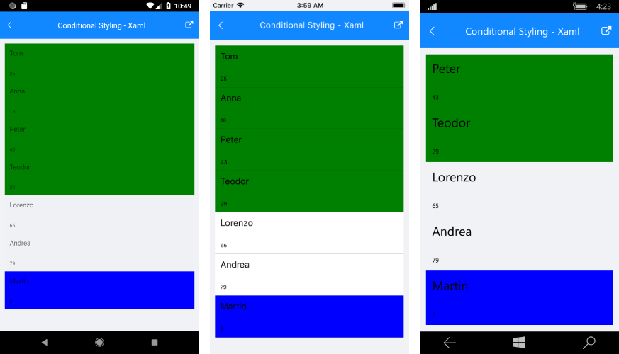

# ItemStyle Selector

The **RadListView** component exposes conditional styling feature. It allows users to apply a different **Style** to each item depending on a specific condition. 

## Example

The following example will demonstrate how to apply the **Conditional Styling** in the RadlistView control.

Lets add the RadlistView component and create a simple data.

Here is an example how to setup the ListView control:

<snippet id='listview-gettingstarted-listview-xaml'/>
<snippet id='listview-gettingstarted-listview-csharp'/>

and lets create a simple data for the ListView component:

<snippet id='listview-styleselector-source'/>

We can set a different style for a specific item using the **ListViewStyleSelector** class. We can use the **OnSelectStyle** method to change the styles of the items in the RadListView control. A sample implementation of a custom class that derives from **ListViewStyleSelector** and overrides its **OnSelectStyle** method is shown below: 

<snippet id='listview-features-onselectstyle'/>

All that is left is to set this custom style selector to the **ItemStyleSelector** property of the **RadListView** control:

<snippet id='listview-features-set-custom-styleselector'/>

## Conditional Styling

This is how the **RadListView** control will look like when conditional styling is used.

>important **SDK Browser** application contains an example that shows StyleSelector feature in RadListView cotrol. You can find the application in the **Examples** folder of your local **Telerik UI for Xamarin** installation.

## See Also

- [Selection]()
- [Styling]()
- [Reordering]()
